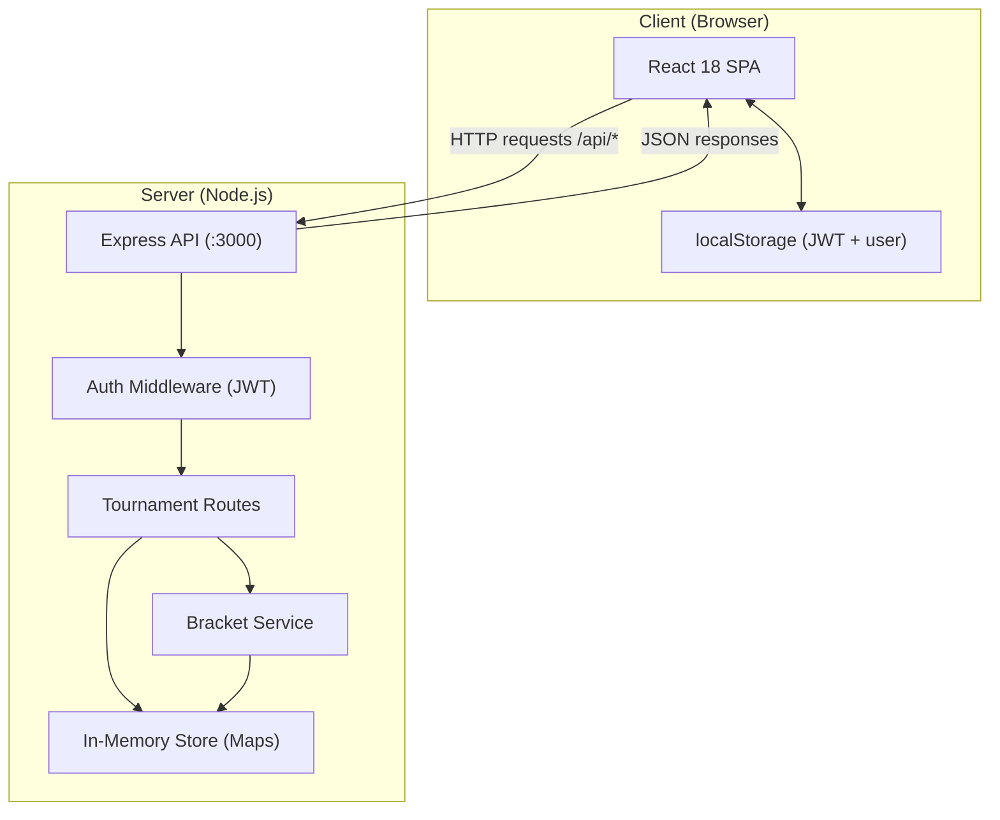
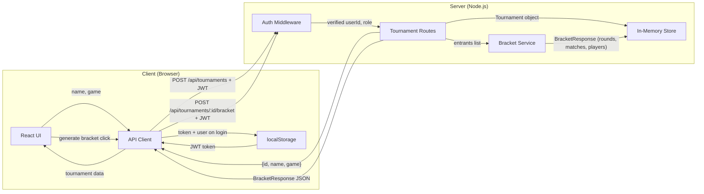
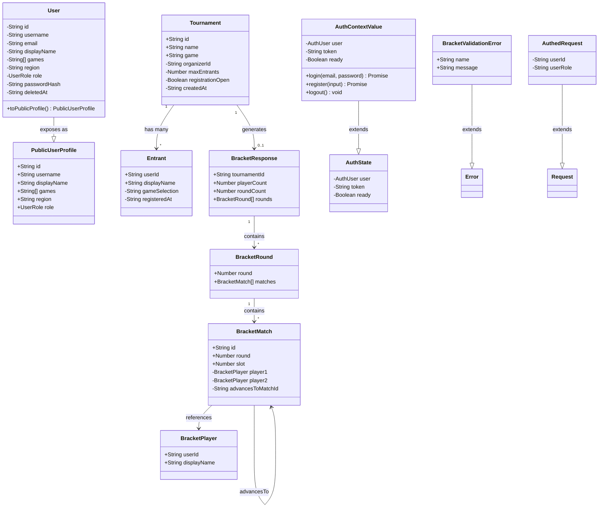

1. **Primary and Secondary Owners**
   - Primary owner: Alex Feies
   - Secondary owner: Benjamin Wilson

2. **Date Code Was Merged into Main**
   - March 25, 2026 (PR #11)

3. **Architecture Diagram**

4. **Information Flow Diagram**

5. **Class Diagram**

6. **List of All Classes**

Below are all classes/interfaces/modules relevant to User Story 1. For each, public fields and methods are listed first, then private, grouped by concept.

---

### Backend

#### `User` (`src/types.ts`)
Purpose: Represents a registered user (organizer or player) in the system.

**Public:**
- *Identity:* `id: string` — unique UUID, `username: string` — login handle, `displayName: string` — human-readable name
- *Profile:* `games: string[]` — games the user plays, `region: string` — geographic region
- *Role:* `role: UserRole` — either `"organizer"` or `"player"`
- *Contact:* `email: string` — login email

**Private:**
- *Security:* `passwordHash: string` — bcrypt-hashed password, never exposed via API
- *Lifecycle:* `deletedAt?: string` — soft-delete timestamp, omitted when active

---

#### `PublicUserProfile` (`src/types.ts`)
Purpose: The safe, public-facing subset of User exposed by API responses.

**Public:**
- *Identity:* `id: string`, `username: string`, `displayName: string`
- *Profile:* `games: string[]`, `region: string`
- *Role:* `role: UserRole`

**Private:** None

---

#### `Tournament` (`src/types.ts`)
Purpose: Represents a tournament event created by an organizer.

**Public:**
- *Identity:* `id: string` — unique UUID, `name: string` — event title, `game: string` — game being played

**Private:**
- *Ownership:* `organizerId: string` — the user who created it
- *Registration:* `maxEntrants: number | null` — capacity limit, `registrationOpen: boolean` — whether sign-ups are accepted
- *Metadata:* `createdAt: string` — ISO timestamp of creation

---

#### `Entrant` (`src/types.ts`)
Purpose: Represents a player registered for a tournament.

**Public:**
- *Identity:* `userId: string` — links to User, `displayName: string` — name shown in bracket

**Private:**
- *Registration:* `gameSelection: string` — game the player selected, `registeredAt: string` — ISO timestamp

---

#### `BracketResponse` (`src/types.ts`)
Purpose: The full generated bracket for a tournament, returned by the bracket generation endpoint.

**Public:**
- *Context:* `tournamentId: string` — which tournament this bracket belongs to
- *Stats:* `playerCount: number` — number of seeded players, `roundCount: number` — total rounds
- *Structure:* `rounds: BracketRound[]` — ordered list of rounds

**Private:** None

---

#### `BracketRound` (`src/types.ts`)
Purpose: A single round within a bracket (e.g., quarterfinals).

**Public:**
- `round: number` — round number (1-indexed)
- `matches: BracketMatch[]` — matches in this round

**Private:** None

---

#### `BracketMatch` (`src/types.ts`)
Purpose: A single match pairing two players.

**Public:**
- *Identity:* `id: string` — e.g. `"r1-m1"`, `round: number`, `slot: number`

**Private:**
- *Players:* `player1: BracketPlayer | null`, `player2: BracketPlayer | null` — null means bye or TBD
- *Advancement:* `advancesToMatchId: string | null` — which match the winner feeds into

---

#### `BracketPlayer` (`src/types.ts`)
Purpose: Minimal player reference used inside bracket matches.

**Public:**
- `userId: string`, `displayName: string`

**Private:** None

---

#### `BracketValidationError` (`src/bracket/singleElimination.ts`)
Purpose: Custom error thrown when bracket generation fails validation (e.g., fewer than 2 players). Extends `Error`.

**Public:**
- `name: string` — always `"BracketValidationError"`
- `message: string` — human-readable error message

**Private:** None

---

#### `JwtPayload` (`src/auth/token.ts`)
Purpose: The decoded payload of a JWT authentication token.

**Public:**
- `sub: string` — user ID
- `role: "organizer" | "player"` — user's role

**Private:** None

---

#### `AuthedRequest` (`src/middleware/auth.ts`)
Purpose: Extends Express `Request` with authenticated user info. Populated by `requireAuth` middleware.

**Public:** None

**Private:**
- *Auth:* `userId?: string` — extracted from JWT, `userRole?: "organizer" | "player"` — extracted from JWT

---

#### Bracket Service — `singleElimination.ts` (`src/bracket/singleElimination.ts`)
Purpose: Contains the algorithm for generating single-elimination brackets.

**Public:**
- `buildSingleEliminationBracket(tournamentId, players)` → `BracketResponse` — main entry point; validates ≥2 players, seeds deterministically, generates rounds with bye handling
- `sortPlayersForSeeding(players)` → `BracketPlayer[]` — stable sort by displayName then userId for deterministic seeding

**Private:**
- `ceilLog2(n)` → `number` — calculates number of rounds needed (⌈log₂(n)⌉)
- `resolveAdvance(prev)` → `BracketPlayer | null` — determines if a bye auto-advances a player from a previous match

---

#### Store — `store.ts` (`src/store.ts`)
Purpose: In-memory data store using Maps. All CRUD operations for users, tournaments, entrants, and brackets.

**Public:**
- *User operations:* `createUser(input)` → `User`, `findUserByEmail(email)` → `User | undefined`, `getUserById(id)` → `User | undefined`, `findUserByUsername(username)` → `User | undefined`, `isEmailTaken(email)` → `boolean`, `isUsernameTaken(username)` → `boolean`, `softDeleteUser(id)` → `User | undefined`, `updateUserProfile(id, patch)` → `User | undefined`, `toPublicUserProfile(user)` → `PublicUserProfile`
- *Tournament operations:* `createTournament(input)` → `Tournament`, `getTournament(id)` → `Tournament | undefined`, `listTournaments()` → `Tournament[]`, `updateTournament(id, updates)` → `Tournament | undefined`
- *Entrant operations:* `addEntrant(tournamentId, entrant)` → `void`, `getEntrants(tournamentId)` → `Entrant[]`
- *Bracket operations:* `setTournamentBracket(tournamentId, bracket)` → `void`, `getTournamentBracket(tournamentId)` → `BracketResponse | undefined`
- *Testing:* `__resetStoreForTests()` → `void`

**Private:**
- *Data:* `users: Map<string, User>`, `usersByEmail: Map<string, string>`, `usersByUsername: Map<string, string>`, `tournaments: Map<string, Tournament>`, `entrantsByTournament: Map<string, Entrant[]>`, `bracketsByTournament: Map<string, BracketResponse>`

---

#### Auth Middleware — `auth.ts` (`src/middleware/auth.ts`)
Purpose: Express middleware functions for authentication and authorization.

**Public:**
- `requireAuth(req, res, next)` — verifies Bearer JWT token, populates `userId` and `userRole` on the request
- `requireOrganizer(req, res, next)` — checks that `userRole === "organizer"`, returns 403 otherwise

**Private:** None

---

#### Token Service — `token.ts` (`src/auth/token.ts`)
Purpose: JWT signing and verification.

**Public:**
- `signToken(payload)` → `string` — creates a JWT with 7-day expiry
- `verifyToken(token)` → `JwtPayload` — decodes and validates a JWT

**Private:**
- `JWT_SECRET: string` — secret key from env or dev default

---

#### Tournament Routes — `tournaments.ts` (`src/routes/tournaments.ts`)
Purpose: Express router handling all tournament-related API endpoints.

**Public:**
- `GET /` — list all tournaments
- `POST /` — create a tournament (organizer only)
- `GET /:id` — get tournament details with entrants
- `GET /:id/entrants` — get ordered entrant list
- `POST /:id/register` — register a player for a tournament
- `PATCH /:id` — update registration status (organizer only)
- `GET /:id/bracket` — get published bracket
- `POST /:id/bracket` — generate bracket (organizer only)

**Private:**
- *Validation:* `createTournamentSchema` (Zod) — validates name/game/maxEntrants, `registerSchema` (Zod) — validates displayName/gameSelection, `patchTournamentSchema` (Zod) — validates registrationOpen/maxEntrants, `bracketBodySchema` (Zod) — validates optional players array

---

### Frontend

#### `AuthUser` (`frontend/src/api.ts`)
Purpose: Lightweight user object stored client-side after login.

**Public:**
- `id: string`, `email: string`, `displayName: string`, `role: UserRole`

**Private:** None

---

#### `TournamentSummary` (`frontend/src/api.ts`)
Purpose: Tournament data as returned by the list endpoint.

**Public:**
- `id: string`, `name: string`, `game: string`, `entrantCount: number`, `maxEntrants: number | null`, `registrationOpen: boolean`, `createdAt: string`

**Private:** None

---

#### `TournamentDetail` (`frontend/src/api.ts`)
Purpose: Full tournament data including entrants list. Extends `TournamentSummary`.

**Public:**
- *Inherited:* all fields from `TournamentSummary`
- `entrants: { userId, displayName, gameSelection, registeredAt }[]`

**Private:** None

---

#### API Client — `api` (`frontend/src/api.ts`)
Purpose: Centralized HTTP client for all backend communication.

**Public:**
- *Auth:* `register(body)` → `{ token, user }`, `login(body)` → `{ token, user }`
- *Tournaments:* `listTournaments()` → `TournamentSummary[]`, `getTournament(id)` → `TournamentDetail`, `createTournament(body)` → `{ id, name, game }`
- *Registration:* `registerForTournament(tournamentId, body)` → entrant confirmation, `getEntrants(tournamentId)` → entrant list
- *Brackets:* `generateBracket(tournamentId)` → `BracketResponse`, `getTournamentBracket(tournamentId)` → `BracketResponse | null`
- *Users:* `getUser(id)` → `UserProfile`, `patchUser(id, body)` → `UserProfile`
- `setStoredToken(token)` → `void` — updates localStorage token

**Private:**
- `getStoredToken()` → `string | null` — reads JWT from localStorage
- `request<T>(path, init)` → `Promise<T>` — generic fetch wrapper that attaches auth headers
- `errorMessage(data, status)` → `string` — extracts error message from API responses

---

#### `AuthProvider` / `useAuth` (`frontend/src/auth-context.tsx`)
Purpose: React context provider managing authentication state across the app.

**Public:**
- `login(email, password)` → `Promise<void>` — authenticates and stores session
- `register(input)` → `Promise<void>` — creates account and stores session
- `logout()` → `void` — clears token and user from state and localStorage
- `useAuth()` → `AuthContextValue` — hook to access auth state from any component

**Private:**
- *State:* `user: AuthUser | null`, `token: string | null`, `ready: boolean`
- `persistSession(token, user)` — saves to both React state and localStorage
- `hydrate()` — on mount, restores session from localStorage and validates with backend

---

#### `NewTournament` (`frontend/src/pages/NewTournament.tsx`)
Purpose: Form page for organizers to create a new tournament.

**Public:**
- Renders a form with `name` and `game` inputs
- On submit, calls `api.createTournament()` and navigates to the tournament detail page

**Private:**
- *State:* `name: string`, `game: string`, `err: string | null`, `loading: boolean`
- `onSubmit(e)` — handles form submission, calls API, navigates on success

---

#### `TournamentDetailPage` (`frontend/src/pages/TournamentDetail.tsx`)
Purpose: Displays tournament info, entrant list, registration form, and bracket generation button.

**Public:**
- Renders tournament details, entrant list, registration form for players, and "Generate bracket" button for organizers

**Private:**
- *State:* `detail: TournamentDetail | null`, `hasPublishedBracket: boolean`, `err: string | null`, `msg: string | null`, `busy: boolean`, `showForm: boolean`, `displayName: string`, `gameSelection: string`
- `load()` — fetches tournament detail and bracket status
- `onRegister(e)` — handles player registration form submission
- `onBracket()` — calls `api.generateBracket()` and navigates to bracket view

---

#### `TournamentBracketPage` (`frontend/src/pages/TournamentBracketPage.tsx`)
Purpose: Displays the generated bracket with rounds, matches, sharing, and export.

**Public:**
- Renders bracket rounds horizontally with match cards, share/export buttons, URL bar, toast notification, and tournament pace/next match info

**Private:**
- *State:* `detail: TournamentDetail | null`, `bracket: BracketResponse | null`, `err: string | null`, `toast: boolean`, `copied: boolean`
- `load()` — fetches tournament detail and bracket data in parallel
- `copyUrl()` — copies bracket URL to clipboard
- `onShare()` — uses Web Share API or falls back to clipboard
- `onExport()` — downloads bracket as JSON file
- `hashStr(s)` — simple hash for deterministic mock scores
- `mockScores(matchId)` — generates fake scores for display
- `winner1Wins(matchId)` — determines mock winner
- `roundLabel(round, totalRounds)` — converts round number to label (e.g., "Semi finals")
- `buildSlotDisplays(m, round, matchSlot, liveMatchId)` — builds display data for each match slot
- `pickLiveMatchId(bracket)` — selects a match to mark as "live"
- `nextMatchLabel(bracket, liveId)` — generates next match description

---

#### `MatchCard` (`frontend/src/pages/TournamentBracketPage.tsx`)
Purpose: React component rendering a single match within the bracket view.

**Public:**
- *Props:* `m: BracketMatch`, `round: number`, `totalRounds: number`, `matchSlot: number`, `liveMatchId: string | null`, `isGrand: boolean`

**Private:** None (stateless presentational component)

7. **Technologies, Libraries, and APIs**

### Languages & Runtimes

#### Node.js
- **a. Used for:** Runtime for the backend Express server.
- **b. Why picked over others:** Required to run JavaScript/TypeScript on the server. Node 20+ provides native `--watch`, stable ESM, and `crypto.randomUUID`. Picked over Deno/Bun for ecosystem maturity and Express compatibility.
- **c. URL:** https://nodejs.org — author: OpenJS Foundation — docs: https://nodejs.org/docs/
- **d. Required version:** ≥20

#### TypeScript
- **a. Used for:** Static typing for both backend and frontend code.
- **b. Why picked over others:** Catches type errors at compile time, improves IDE tooling, and documents data shapes (Tournament, Entrant, BracketResponse, etc.) better than plain JS. Picked over Flow for ecosystem and tooling support.
- **c. URL:** https://www.typescriptlang.org — author: Microsoft — docs: https://www.typescriptlang.org/docs/
- **d. Required version:** ^5.8.2

---

### Backend Dependencies

#### Express
- **a. Used for:** HTTP server and routing for the `/api/*` endpoints.
- **b. Why picked over others:** The most widely used Node web framework — minimal, battle-tested, easy middleware composition. Picked over Fastify/Koa for ecosystem familiarity.
- **c. URL:** https://expressjs.com — author: OpenJS Foundation — docs: https://expressjs.com/en/4x/api.html
- **d. Required version:** ^4.21.2

#### bcryptjs
- **a. Used for:** Hashing user passwords before storing them.
- **b. Why picked over others:** Pure-JS implementation of bcrypt — no native build step, works on every platform. Picked over `bcrypt` (native) to avoid install issues.
- **c. URL:** https://github.com/dcodeIO/bcrypt.js — author: Daniel Wirtz — docs: https://github.com/dcodeIO/bcrypt.js#usage
- **d. Required version:** ^3.0.2

#### jsonwebtoken
- **a. Used for:** Signing and verifying JWT auth tokens (`signToken` / `verifyToken` in `src/auth/token.ts`).
- **b. Why picked over others:** De-facto standard JWT library for Node. Picked over `jose` for simplicity since we only need HS256.
- **c. URL:** https://github.com/auth0/node-jsonwebtoken — author: Auth0 — docs: https://github.com/auth0/node-jsonwebtoken#readme
- **d. Required version:** ^9.0.2

#### Zod
- **a. Used for:** Runtime validation of request bodies (`createTournamentSchema`, `registerSchema`, `bracketBodySchema` in `src/routes/tournaments.ts`).
- **b. Why picked over others:** Schema-first validation that infers TypeScript types automatically. Picked over Joi/Yup because of TS inference and zero dependencies.
- **c. URL:** https://zod.dev — author: Colin McDonnell — docs: https://zod.dev/
- **d. Required version:** ^3.24.2

---

### Frontend Dependencies

#### React
- **a. Used for:** UI framework for the entire frontend (NewTournament, TournamentDetail, TournamentBracketPage, etc.).
- **b. Why picked over others:** Largest ecosystem, team familiarity, concurrent rendering features. Picked over Vue/Svelte for hiring and component library availability.
- **c. URL:** https://react.dev — author: Meta — docs: https://react.dev/reference/react
- **d. Required version:** ^18.3.1

#### react-dom
- **a. Used for:** Renders React components to the browser DOM.
- **b. Why picked over others:** Required companion to React for web targets — no real alternative.
- **c. URL:** https://react.dev — author: Meta — docs: https://react.dev/reference/react-dom
- **d. Required version:** ^18.3.1

#### react-router-dom
- **a. Used for:** Client-side routing — `/new`, `/t/:id`, `/t/:id/bracket`, etc.
- **b. Why picked over others:** Standard React routing library. v6 has the cleanest nested route API. Picked over TanStack Router for maturity.
- **c. URL:** https://reactrouter.com — author: Remix team — docs: https://reactrouter.com/en/main
- **d. Required version:** ^6.30.0

#### lucide-react
- **a. Used for:** Icons in the bracket page (Check, Download, Share2, X).
- **b. Why picked over others:** Tree-shakable SVG icon set with consistent visual style. Picked over Heroicons/Font Awesome for size and React-first API.
- **c. URL:** https://lucide.dev — author: Lucide contributors — docs: https://lucide.dev/guide/packages/lucide-react
- **d. Required version:** ^0.483.0

---

### Build & Dev Tooling

#### Vite
- **a. Used for:** Frontend dev server and production build for the React app.
- **b. Why picked over others:** Native ESM dev server with instant HMR, much faster than webpack. Picked over Webpack/Parcel for build speed and zero-config defaults.
- **c. URL:** https://vitejs.dev — author: Evan You / Vite team — docs: https://vitejs.dev/guide/
- **d. Required version:** ^6.2.1

#### @vitejs/plugin-react
- **a. Used for:** React Fast Refresh and JSX transform support inside Vite.
- **b. Why picked over others:** Official plugin maintained by the Vite team — required to use React with Vite.
- **c. URL:** https://github.com/vitejs/vite-plugin-react — author: Vite team — docs: https://github.com/vitejs/vite-plugin-react/tree/main/packages/plugin-react
- **d. Required version:** ^4.3.4

#### tsx
- **a. Used for:** Running TypeScript files directly in development (`node --import tsx src/index.ts`).
- **b. Why picked over others:** Avoids a separate build step during dev. Picked over `ts-node` for ESM support and speed.
- **c. URL:** https://github.com/privatenumber/tsx — author: Hiroki Osame — docs: https://tsx.is/
- **d. Required version:** ^4.19.3

---

### Testing

#### Vitest
- **a. Used for:** Backend unit and integration tests (`npm test`).
- **b. Why picked over others:** Vite-native test runner with Jest-compatible API. Faster than Jest for TS projects, no separate config. Picked over Jest for ESM support and speed.
- **c. URL:** https://vitest.dev — author: Vitest team — docs: https://vitest.dev/guide/
- **d. Required version:** ^3.0.9

#### supertest
- **a. Used for:** HTTP assertions against the Express app in integration tests.
- **b. Why picked over others:** De-facto standard for testing Express endpoints without spinning up a real server. Picked over manual `fetch` calls for richer assertion API.
- **c. URL:** https://github.com/ladjs/supertest — author: Doug Wilson / TJ Holowaychuk — docs: https://github.com/ladjs/supertest#readme
- **d. Required version:** ^7.0.0

---

### Type Definitions (devDependencies)

These provide TypeScript types for libraries that ship plain JS. Required for compilation but no runtime impact. All from the DefinitelyTyped project (https://github.com/DefinitelyTyped/DefinitelyTyped).

#### @types/node
- **a. Used for:** TypeScript types for Node.js built-ins.
- **b. Why picked over others:** Official community-maintained types for Node. No alternative.
- **c. URL:** https://www.npmjs.com/package/@types/node
- **d. Required version:** ^22.13.10

#### @types/express
- **a. Used for:** TypeScript types for Express.
- **b. Why picked over others:** Official community-maintained types. No alternative.
- **c. URL:** https://www.npmjs.com/package/@types/express
- **d. Required version:** ^4.17.21

#### @types/bcryptjs
- **a. Used for:** TypeScript types for bcryptjs.
- **b. Why picked over others:** Official community-maintained types. No alternative.
- **c. URL:** https://www.npmjs.com/package/@types/bcryptjs
- **d. Required version:** ^2.4.6

#### @types/jsonwebtoken
- **a. Used for:** TypeScript types for jsonwebtoken.
- **b. Why picked over others:** Official community-maintained types. No alternative.
- **c. URL:** https://www.npmjs.com/package/@types/jsonwebtoken
- **d. Required version:** ^9.0.9

#### @types/supertest
- **a. Used for:** TypeScript types for supertest.
- **b. Why picked over others:** Official community-maintained types. No alternative.
- **c. URL:** https://www.npmjs.com/package/@types/supertest
- **d. Required version:** ^6.0.2

#### @types/react
- **a. Used for:** TypeScript types for React.
- **b. Why picked over others:** Official community-maintained types. No alternative.
- **c. URL:** https://www.npmjs.com/package/@types/react
- **d. Required version:** ^18.3.18

#### @types/react-dom
- **a. Used for:** TypeScript types for react-dom.
- **b. Why picked over others:** Official community-maintained types. No alternative.
- **c. URL:** https://www.npmjs.com/package/@types/react-dom
- **d. Required version:** ^18.3.5

---

### Browser APIs (no install required, ship with the browser)

#### Fetch API
- **a. Used for:** All HTTP calls from the frontend `api.ts` client to the backend.
- **b. Why picked over others:** Native browser API — no library needed. Picked over axios to avoid the dependency.
- **c. URL:** https://developer.mozilla.org/en-US/docs/Web/API/Fetch_API
- **d. Required version:** Modern evergreen browsers (built-in)

#### localStorage
- **a. Used for:** Persisting JWT token and cached user (`mp_token`, `mp_user`).
- **b. Why picked over others:** Simplest browser persistence API. Picked over IndexedDB because we only store small key/value pairs.
- **c. URL:** https://developer.mozilla.org/en-US/docs/Web/API/Window/localStorage
- **d. Required version:** Modern evergreen browsers (built-in)

#### Web Share API
- **a. Used for:** `TournamentBracketPage.onShare()` — sharing the bracket URL natively on supported devices.
- **b. Why picked over others:** Native OS share sheet on mobile. Falls back to Clipboard API where unsupported.
- **c. URL:** https://developer.mozilla.org/en-US/docs/Web/API/Web_Share_API
- **d. Required version:** Modern evergreen browsers (built-in)

#### Clipboard API
- **a. Used for:** Fallback for sharing and the "COPY" button on the bracket URL bar.
- **b. Why picked over others:** Native browser clipboard access — no library needed.
- **c. URL:** https://developer.mozilla.org/en-US/docs/Web/API/Clipboard_API
- **d. Required version:** Modern evergreen browsers (built-in)

#### URL.createObjectURL
- **a. Used for:** `onExport()` — downloading the bracket as a JSON file.
- **b. Why picked over others:** Standard way to generate a downloadable blob URL in the browser.
- **c. URL:** https://developer.mozilla.org/en-US/docs/Web/API/URL/createObjectURL_static
- **d. Required version:** Modern evergreen browsers (built-in)

8. **Data Types in Long-Term Storage**

> **Note:** The current implementation uses in-memory `Map` data structures in `src/store.ts` rather than a real database, which means all data is lost on every server restart. **This is not the final design** — a real database (likely SQLite for early stages, Postgres for production) will be implemented later, and the data shapes below describe what *will* be persisted in long-term storage once that work is done. The in-memory store is the conceptual stand-in until then. Byte estimates assume UTF-8 encoding and typical field lengths; actual size depends on input.

---

### `User`

Stored in: `users: Map<string, User>` (with secondary indexes `usersByEmail`, `usersByUsername`).

| Field | Type | Purpose | Estimated Bytes |
|---|---|---|---|
| `id` | string (UUID v4) | Unique identifier; primary key | 36 |
| `username` | string | Unique login handle | ~20 |
| `email` | string | Unique login email, lowercased | ~30 |
| `passwordHash` | string (bcrypt) | Hashed password for login verification — never returned | 60 |
| `displayName` | string | Human-readable name shown in the UI | ~25 |
| `games` | string[] | Games the user plays (for filtering and seeding) | ~30 (2 games avg) |
| `region` | string | Geographic region used for matchmaking and display | ~15 |
| `role` | "organizer" \| "player" | Authorization role; gates tournament creation | ~9 |
| `deletedAt` | string? (ISO timestamp) | Soft-delete marker; null/missing when active | ~24 (when present) |

**Total per user:** ~250 bytes

---

### `Tournament`

Stored in: `tournaments: Map<string, Tournament>`.

| Field | Type | Purpose | Estimated Bytes |
|---|---|---|---|
| `id` | string (UUID v4) | Unique identifier; primary key | 36 |
| `name` | string | Tournament title displayed to users | ~50 |
| `game` | string | Game being played at this tournament | ~25 |
| `organizerId` | string (UUID) | Foreign key to the User who created it | 36 |
| `maxEntrants` | number \| null | Capacity limit; null = unlimited | 8 |
| `registrationOpen` | boolean | Whether new registrations are accepted | 1 |
| `createdAt` | string (ISO timestamp) | When the tournament was created | 24 |

**Total per tournament:** ~180 bytes

---

### `Entrant`

Stored in: `entrantsByTournament: Map<string, Entrant[]>` (one array per tournament).

| Field | Type | Purpose | Estimated Bytes |
|---|---|---|---|
| `userId` | string (UUID) | Foreign key to the User who registered | 36 |
| `displayName` | string | Name to show in the bracket (may differ from User.displayName) | ~25 |
| `gameSelection` | string | Game variant the player chose for this event | ~25 |
| `registeredAt` | string (ISO timestamp) | When the player signed up; used for ordering | 24 |

**Total per entrant:** ~110 bytes

---

### `BracketResponse`

Stored in: `bracketsByTournament: Map<string, BracketResponse>` (one per tournament after generation).

#### Top-level
| Field | Type | Purpose | Estimated Bytes |
|---|---|---|---|
| `tournamentId` | string (UUID) | Foreign key to the Tournament | 36 |
| `playerCount` | number | Number of seeded players | 8 |
| `roundCount` | number | Total rounds (⌈log₂(playerCount)⌉) | 8 |
| `rounds` | BracketRound[] | Ordered list of rounds | (see below) |

#### `BracketRound` (one per round)
| Field | Type | Purpose | Estimated Bytes |
|---|---|---|---|
| `round` | number | Round number (1-indexed) | 8 |
| `matches` | BracketMatch[] | Matches in this round | (see below) |

#### `BracketMatch` (one per match)
| Field | Type | Purpose | Estimated Bytes |
|---|---|---|---|
| `id` | string | Match identifier (e.g., `"r1-m1"`) | ~10 |
| `round` | number | Round number this match belongs to | 8 |
| `slot` | number | Position within the round | 8 |
| `player1` | BracketPlayer \| null | First player slot; null = bye/TBD | ~65 |
| `player2` | BracketPlayer \| null | Second player slot; null = bye/TBD | ~65 |
| `advancesToMatchId` | string \| null | The match the winner feeds into | ~10 |

#### `BracketPlayer` (embedded in matches)
| Field | Type | Purpose | Estimated Bytes |
|---|---|---|---|
| `userId` | string (UUID) | Reference to the User | 36 |
| `displayName` | string | Name shown in the bracket cell | ~25 |

**Total per match:** ~165 bytes
**Total per bracket (8-player example):** 7 matches × 165 + round overhead (~30 × 3) + top-level (~60) ≈ **1,300 bytes**
**Total per bracket (32-player example):** 31 matches × 165 + round overhead (~30 × 5) + top-level (~60) ≈ **5,330 bytes**

---

### Storage Footprint Summary

| Type | Avg bytes per row | Notes |
|---|---|---|
| User | ~250 | Grows linearly with signups |
| Tournament | ~180 | Grows linearly with events created |
| Entrant | ~110 | Multiplied by `playerCount` per tournament |
| BracketResponse (8p) | ~1,300 | One per tournament after generation |
| BracketResponse (32p) | ~5,330 | Scales with player count |

**Example total for one 16-player tournament:** 1 Tournament (~180) + 16 Entrants (~1,760) + 1 Bracket (~2,500) ≈ **4,440 bytes**, plus organizer User (~250) and 16 player Users (~4,000) ≈ **8,690 bytes total** in long-term storage.

9. **Failure Mode Effects**

#### a. Frontend process crashed
- **User-visible:** Browser tab shows blank page or React error overlay; in-progress form input is lost.
- **Internal:** No backend impact. React state and Auth Context wiped; localStorage (JWT + user) survives, so reload re-authenticates.

#### b. Lost all runtime state
- **User-visible:** User is bounced to login or sees an empty dashboard until reload re-fetches.
- **Internal:** AuthContext reverts to `ready=false`, then re-hydrates from localStorage and re-calls `api.getUser()`.

#### c. Erased all stored data (localStorage)
- **User-visible:** User is logged out; must log in again.
- **Internal:** `mp_token` and `mp_user` gone; `useAuth()` returns `null`; protected routes redirect to `/login`.

#### d. Data in the database appeared corrupt
- **User-visible:** Tournament/bracket pages may show "Not found" or render garbled names.
- **Internal:** Backend returns 404 or 500; frontend `request()` throws and shows an error banner. No automatic recovery — currently no schema validation on reads.

#### e. Remote procedure call (API call) failed
- **User-visible:** Inline error banner ("Could not create", "Registration failed", etc.); the action button re-enables so the user can retry.
- **Internal:** `request()` in `api.ts` throws; calling component catches and sets `err` state. No automatic retry.

#### f. Client overloaded
- **User-visible:** UI becomes janky/unresponsive; bracket renders slowly for very large tournaments.
- **Internal:** React render loop stalls; no virtualization on the entrants list or bracket grid.

#### g. Client out of RAM
- **User-visible:** Browser tab crashes ("Aw, Snap!" or similar).
- **Internal:** Same as (a) — process restart via reload, localStorage survives.

#### h. Database out of space
- **User-visible:** Tournament creation, registration, and bracket generation all fail with a 500 error.
- **Internal:** N/A today (in-memory store has no disk). Once a real DB exists: writes fail at the driver level; reads still work until eviction.

#### i. Lost network connectivity
- **User-visible:** Every action shows an error banner ("Failed to fetch"); cached pages still render from React state.
- **Internal:** `fetch()` rejects; no offline queue or service worker.

#### j. Lost access to its database
- **User-visible:** All API calls fail; tournament/bracket pages stuck on "Loading…" or show error banners.
- **Internal:** N/A today (store is in-process). Once a real DB exists: route handlers throw on every query, return 500.

#### k. Bot signs up and spams users
- **User-visible:** Tournament listings flooded with junk events; entrant lists polluted; legitimate organizers can't find their tournaments.
- **Internal:** No rate limiting, no CAPTCHA, no email verification. `POST /api/auth/register` accepts any email matching the Zod schema. Bot accounts can repeatedly call `POST /api/tournaments` (if registered as organizer) or `POST /api/tournaments/:id/register`.

10. **Personally Identifying Information (PII)**

### List of PII stored

| Field | Where | Notes |
|---|---|---|
| `email` | `User.email` | Login identifier, lowercased |
| `displayName` | `User.displayName` | Often a real first/last name |
| `username` | `User.username` | Handle, may double as a real name |
| `region` | `User.region` | Geographic region (city/country level) |
| `passwordHash` | `User.passwordHash` | Bcrypt hash — credential, not identity, but treated as sensitive |

#### a. Justification for storing each
- **email** — required for login and account recovery.
- **displayName** — required to show players in tournament rosters and bracket cells.
- **username** — required as a unique handle for profile URLs.
- **region** — used for matchmaking/seeding and shown on public profiles.
- **passwordHash** — required to verify login attempts; never stored as plaintext.

#### b. How it is stored
- Currently in JavaScript `Map` objects in process memory (`src/store.ts`). **No encryption at rest, no disk persistence.**
- `passwordHash` is bcrypt-hashed with 10 salt rounds (`bcrypt.hashSync(password, 10)`) before storage.
- Future: same fields will move into a Postgres/SQLite table with encryption at rest and TLS in transit.

#### c. How the data entered the system
- Through `POST /api/auth/register` when a user signs up via the frontend register form.
- Request body: `{ email, password, displayName, role }`. `username` defaults to `displayName` if not provided.

#### d. Path *before* entering long-term storage
1. `RegisterPage` (frontend form) → calls `api.register(body)`
2. `api.register()` (`frontend/src/api.ts`) → `POST /api/auth/register`
3. `routes/auth.ts` → validates with `registerSchema` (Zod)
4. `bcrypt.hashSync(password, 10)` → produces `passwordHash`
5. `store.createUser({ email, passwordHash, displayName, role })`
6. Lands in `users: Map<string, User>` plus `usersByEmail` and `usersByUsername` indexes

#### e. Path *after* leaving long-term storage
1. `store.getUserById(id)` or `store.findUserByEmail(email)` → returns full `User`
2. Either `store.toPublicUserProfile(user)` strips sensitive fields, **or** route handler hand-picks fields (e.g., `routes/auth.ts` returns `{ id, email, displayName, role }`)
3. Response sent to `frontend/src/api.ts` → `request<T>()`
4. Stored in `AuthContext` (`frontend/src/auth-context.tsx`) and persisted to `localStorage` (`mp_user`)
5. Rendered in components like `DashboardPage`, `TournamentDetail`, `PlayerProfilePage`

#### f. People responsible for securing storage
- **Alex Feies** and **Andre Miller** have responsibility for securing long-term storage.

#### g. Audit procedures for routine and non-routine access
- **Currently:** none. There is no logging of read/write access to PII, no audit trail, and no separation of duties.
- **Planned:** enable query/access logs at the DB layer, review them weekly for routine access, and require a written justification + review for non-routine access (e.g., debugging a specific user's record).

#### h. Minors' PII
- **i. Is minor PII solicited or stored, and why?** The system does not explicitly solicit minors' PII, but it also does not check age at registration. There is no `dateOfBirth` field and no age gate, so a minor could sign up and we would unknowingly store their email, name, and region. This gap should be closed before launch.
- **ii. Does the app solicit guardian permission?** No. There is no guardian-consent flow today. To comply with COPPA (US, under 13) and similar laws, an age check at registration plus a guardian consent step for minors must be added.
- **iii. Policy for keeping minors' PII away from convicted/suspected child abusers:** No formal policy exists yet. Before launch, the team must adopt a written policy that (1) requires background checks for any team member with direct DB access, (2) immediately revokes access for any team member subject to a credible allegation, and (3) logs and reviews all access to records flagged as belonging to a minor.
