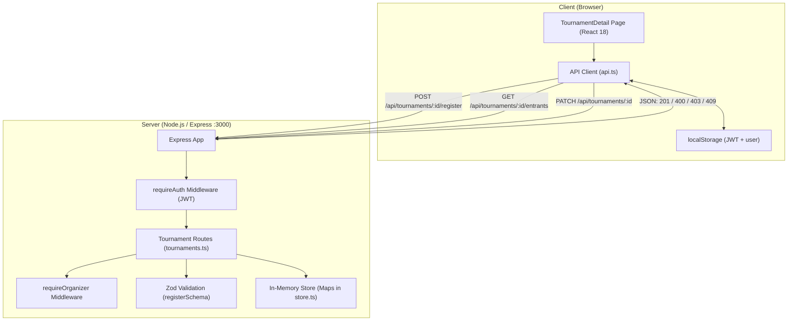
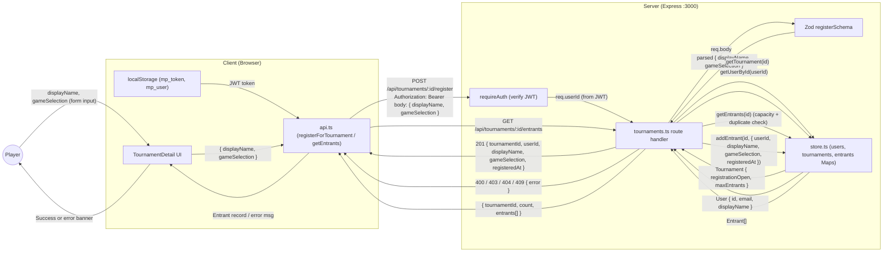
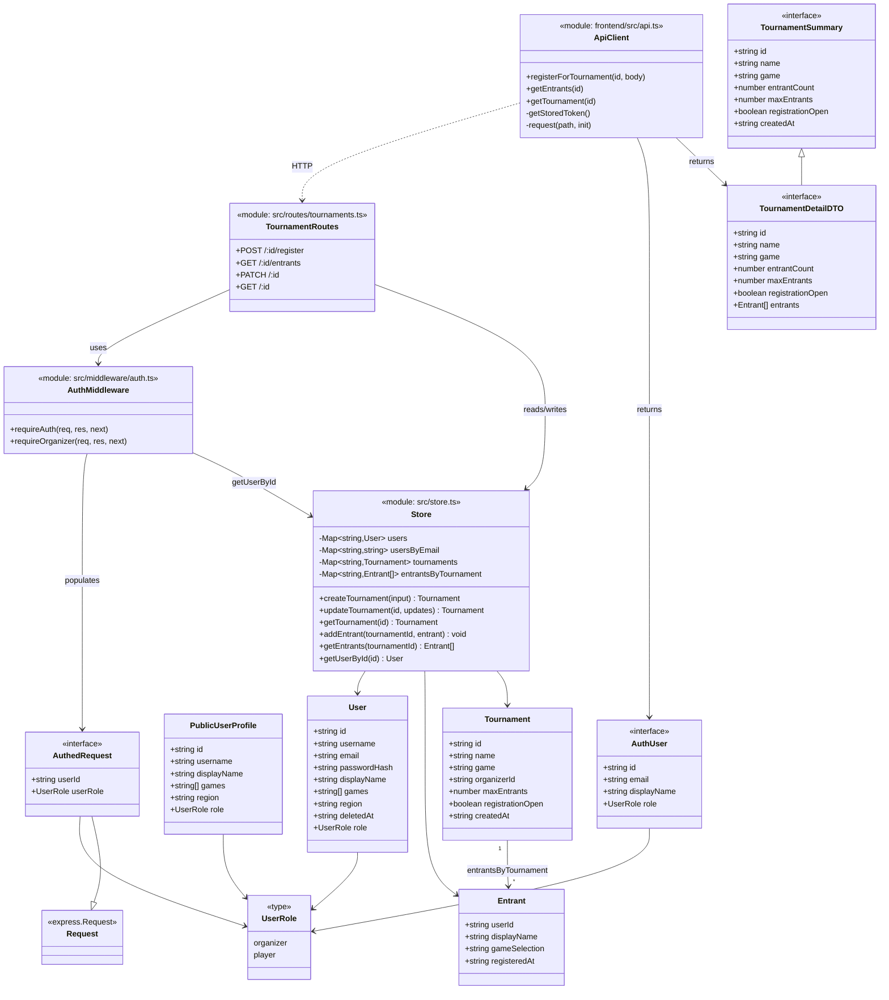

1. **Primary and Secondary Owners**
   - Primary owner: Eshar
   - Secondary owner: Guilherme

2. **Date Code Was Merged into Main**
   - March 26, 2026 (PR #24)

3. **Architecture Diagram**

4. **Information Flow Diagram**

5. **Class Diagram**

6. **List of All Classes**

Below are all classes/interfaces/modules relevant to User Story 2 (player registration). For each, public fields and methods are listed first, then private, grouped by concept.

---

### Backend

#### `User` (`src/types.ts`)
Purpose: Represents a registered user (organizer or player). The registering player is loaded via `getUserById` during the registration request.

**Public:**
- *Identity:* `id: string` — UUID, used as the entrant's `userId`; `username: string` — unique handle; `displayName: string` — default name shown in entrant lists
- *Profile:* `games: string[]` — games the user plays; `region: string` — geographic region
- *Role:* `role: UserRole` — `"organizer"` or `"player"`; controls access to PATCH/registration-close endpoints
- *Contact:* `email: string` — login email

**Private:**
- *Security:* `passwordHash: string` — bcrypt hash, never exposed by the registration response
- *Lifecycle:* `deletedAt?: string` — soft-delete timestamp; `requireAuth` rejects users with this set

---

#### `PublicUserProfile` (`src/types.ts`)
Purpose: Safe public-facing subset of `User`. Not directly returned by US2 endpoints but consumed by adjacent profile reads.

**Public:**
- *Identity:* `id: string`, `username: string`, `displayName: string`
- *Profile:* `games: string[]`, `region: string`
- *Role:* `role: UserRole`

**Private:** None

---

#### `Tournament` (`src/types.ts`)
Purpose: A tournament event a player can register for. The registration handler reads `registrationOpen` and `maxEntrants` to gate sign-ups.

**Public:**
- *Identity:* `id: string`, `name: string`, `game: string`

**Private:**
- *Ownership:* `organizerId: string` — used by `requireOrganizer` flow on PATCH
- *Registration:* `maxEntrants: number | null` — capacity; `null` means unlimited; `registrationOpen: boolean` — gate that closes sign-ups
- *Metadata:* `createdAt: string` — ISO timestamp

---

#### `Entrant` (`src/types.ts`)
Purpose: A player registration record. One row in the `entrantsByTournament` list, written by `addEntrant` on a successful POST `/register`.

**Public:**
- *Identity:* `userId: string` — links to `User.id`; `displayName: string` — name shown on the entrant list (may differ from `User.displayName`)

**Private:**
- *Registration:* `gameSelection: string` — game the player chose at registration; `registeredAt: string` — ISO timestamp used to order the entrant list

---

#### `UserRole` (`src/types.ts`)
Purpose: String literal type used for authorization checks.

**Public:**
- *Values:* `"organizer" | "player"`

**Private:** None

---

#### `Store` (`src/store.ts`)
Purpose: In-memory data layer. All US2 reads/writes go through this module: tournament lookup, entrant list, user lookup, capacity/duplicate enforcement.

**Public:**
- *Tournament lifecycle:* `createTournament(input) → Tournament` — creates a tournament and initializes its empty entrant list; `updateTournament(id, updates) → Tournament | undefined` — used by PATCH to flip `registrationOpen` or change `maxEntrants`; `getTournament(id) → Tournament | undefined` — fetches by id; `listTournaments() → Tournament[]` — returns all tournaments sorted by `createdAt` desc
- *Entrant management:* `addEntrant(tournamentId, entrant) → void` — appends an Entrant after validation succeeds; `getEntrants(tournamentId) → Entrant[]` — returns the entrant list (used both for capacity/duplicate checks and the GET `/entrants` response)
- *User lookup:* `getUserById(id) → User | undefined` — used by the registration handler to load the authenticated user

**Private:**
- *Storage maps:* `users: Map<string, User>` — user table; `usersByEmail: Map<string, string>` — email index; `usersByUsername: Map<string, string>` — username index; `tournaments: Map<string, Tournament>` — tournament table; `entrantsByTournament: Map<string, Entrant[]>` — registration table keyed by tournament id; `bracketsByTournament: Map<string, BracketResponse>` — adjacent bracket cache

---

#### `TournamentRoutes` (`src/routes/tournaments.ts`)
Purpose: Express router that exposes the registration endpoints. Wires together Zod validation, auth middleware, and the store.

**Public (route handlers):**
- *Registration:* `POST /:id/register` — validates body via a local Zod schema (`displayName`, `gameSelection`, both non-empty; 400 on failure), requires auth, runs existence/open/capacity/duplicate checks, calls `addEntrant`, returns the new entrant record (201)
- *Read entrants:* `GET /:id/entrants` — returns a registration-time-ordered list `{ tournamentId, count, entrants[] }` (no auth required)
- *Update tournament:* `PATCH /:id` — validates via a local Zod schema (`registrationOpen?: boolean`, `maxEntrants?: number|null`), requires auth + organizer, calls `updateTournament` to toggle `registrationOpen` or change `maxEntrants`
- *Read detail:* `GET /:id` — returns the tournament with its embedded entrant list (used by the registration page after successful sign-up)

**Private:**
- *Helpers from store:* references to `getTournament`, `getEntrants`, `getUserById`, `addEntrant`, `updateTournament`

---

#### `AuthMiddleware` (`src/middleware/auth.ts`)
Purpose: Express middleware that gates the registration and PATCH endpoints.

**Public:**
- *Methods:* `requireAuth(req, res, next)` — verifies the `Authorization: Bearer <JWT>` header, decodes via `verifyToken`, loads the user, attaches `userId`/`userRole` to `req`, and calls `next()`. Sends 401 on missing/invalid token or deleted user. `requireOrganizer(req, res, next)` — checks `req.userRole === "organizer"`; sends 403 otherwise.

**Private:**
- *Helpers from other modules:* `verifyToken` from `src/auth/token.ts`; `getUserById` from `src/store.ts`

---

#### `AuthedRequest` (`src/middleware/auth.ts`)
Purpose: Express `Request` extended with the auth context populated by `requireAuth`. Used as the typed `req` in protected handlers like `POST /:id/register`.

**Public:**
- *Auth context:* `userId?: string` — populated by `requireAuth`; `userRole?: "organizer" | "player"` — same

**Private:** None (everything inherited from `Request`)

---

### Frontend

#### `ApiClient` (`frontend/src/api.ts`)
Purpose: Typed HTTP client used by the registration UI. Wraps `fetch`, attaches JWT, parses JSON, throws on non-2xx.

**Public (US2-relevant methods):**
- *Registration:* `registerForTournament(tournamentId, { displayName, gameSelection }) → Promise<EntrantRecord>` — POSTs to `/api/tournaments/:id/register`
- *Reads:* `getEntrants(tournamentId) → Promise<{ tournamentId, count, entrants[] }>` — GETs `/api/tournaments/:id/entrants` (no auth); `getTournament(id) → Promise<TournamentDetailDTO>` — GETs `/api/tournaments/:id` and is called after a successful registration to refresh the page
- *Token persistence:* `setStoredToken(token | null) → void` — writes/clears `mp_token` in localStorage

**Private:**
- *Internal helpers:* `request<T>(path, init) → Promise<T>` — shared fetch wrapper that injects `Authorization: Bearer <token>`, parses JSON, and throws on non-2xx; `getStoredToken() → string | null` — reads `mp_token` from localStorage; `errorMessage(data, status) → string` — extracts a human-readable error from a response body
- *Constants:* `jsonHeaders` — default `Content-Type: application/json`

---

#### `TournamentSummary` (`frontend/src/api.ts`)
Purpose: Typed shape returned by the tournament list endpoint. Parent of `TournamentDetailDTO`.

**Public:**
- *Identity:* `id: string`, `name: string`, `game: string`
- *Registration:* `entrantCount: number`, `maxEntrants: number | null`, `registrationOpen: boolean`
- *Metadata:* `createdAt: string`

**Private:** None

---

#### `TournamentDetailDTO` (`frontend/src/api.ts` — `TournamentDetail`)
Purpose: Typed shape returned by GET `/api/tournaments/:id`. Holds the embedded entrant list rendered after registration.

**Public:**
- *Inherited from `TournamentSummary`:* `id`, `name`, `game`, `entrantCount`, `maxEntrants`, `registrationOpen`, `createdAt`
- *Entrants:* `entrants: { userId: string; displayName: string; gameSelection: string; registeredAt: string }[]` — used to render the live entrant count/list

**Private:** None

---

#### `AuthUser` (`frontend/src/api.ts`)
Purpose: Authenticated user shape returned by login/register and held in `localStorage` (`mp_user`). The registration page uses it to pre-fill `displayName`.

**Public:**
- *Identity:* `id: string`, `email: string`, `displayName: string`
- *Role:* `role: UserRole`

**Private:** None

7. **Technologies, Libraries, and APIs**

### Languages & Runtimes

#### Node.js
- **a. Used for:** Runtime for the backend Express server that hosts the registration endpoints (`POST /:id/register`, `GET /:id/entrants`, `PATCH /:id`).
- **b. Why picked over others:** Required to run TypeScript on the server. Node 20+ provides stable ESM and `crypto.randomUUID` (used elsewhere in the store). Picked over Deno/Bun for ecosystem maturity and Express compatibility.
- **c. URL:** https://nodejs.org — author: OpenJS Foundation — docs: https://nodejs.org/docs/
- **d. Required version:** ≥20

#### TypeScript
- **a. Used for:** Static typing of all registration code — `Entrant`, `Tournament`, route handlers, and the frontend `api.ts` client (`registerForTournament`, `getEntrants`).
- **b. Why picked over others:** Catches type errors at compile time and makes the request/response shapes for registration self-documenting. Picked over plain JS / Flow for tooling and ecosystem support.
- **c. URL:** https://www.typescriptlang.org — author: Microsoft — docs: https://www.typescriptlang.org/docs/
- **d. Required version:** ^5.8.2

---

### Backend Dependencies

#### Express
- **a. Used for:** HTTP server and routing for the registration endpoints in `src/routes/tournaments.ts`. Also hosts the `requireAuth` / `requireOrganizer` middleware chain.
- **b. Why picked over others:** The most widely used Node web framework — minimal, easy middleware composition for the auth → validate → handler pipeline. Picked over Fastify/Koa for ecosystem familiarity.
- **c. URL:** https://expressjs.com — author: OpenJS Foundation — docs: https://expressjs.com/en/4x/api.html
- **d. Required version:** ^4.21.2

#### cors
- **a. Used for:** Express middleware that allows the Vite frontend (`:5173`) to call the API (`:3000`) during development.
- **b. Why picked over others:** Standard Express CORS middleware. No real alternative for this use case.
- **c. URL:** https://github.com/expressjs/cors — author: Express team — docs: https://expressjs.com/en/resources/middleware/cors.html
- **d. Required version:** ^2.8.5

#### jsonwebtoken
- **a. Used for:** Verifying the `Authorization: Bearer <JWT>` header inside `requireAuth`, which protects `POST /:id/register` and `PATCH /:id`. Without a valid token the registration endpoint returns 401.
- **b. Why picked over others:** De-facto standard JWT library for Node. Picked over `jose` for simplicity since we only need HS256.
- **c. URL:** https://github.com/auth0/node-jsonwebtoken — author: Auth0 — docs: https://github.com/auth0/node-jsonwebtoken#readme
- **d. Required version:** ^9.0.2

#### Zod
- **a. Used for:** Runtime validation of the registration request body (non-empty `displayName` and `gameSelection`) and the PATCH body (`registrationOpen`, `maxEntrants`). Drives the 400 response on missing fields, satisfying the "400 on missing required fields" acceptance criterion.
- **b. Why picked over others:** Schema-first validation that infers TypeScript types automatically, so handler code can use the parsed data without re-typing it. Picked over Joi/Yup for TS inference and zero dependencies.
- **c. URL:** https://zod.dev — author: Colin McDonnell — docs: https://zod.dev/
- **d. Required version:** ^3.24.2

#### bcryptjs
- **a. Used for:** Hashing user passwords at signup. Indirectly relevant to US2 because the registering player must be an authenticated user whose record was created with a bcrypt-hashed password.
- **b. Why picked over others:** Pure-JS implementation of bcrypt — no native build step. Picked over `bcrypt` (native) to avoid install issues.
- **c. URL:** https://github.com/dcodeIO/bcrypt.js — author: Daniel Wirtz — docs: https://github.com/dcodeIO/bcrypt.js#usage
- **d. Required version:** ^3.0.2

---

### Frontend Dependencies

#### React
- **a. Used for:** UI framework for the registration page (`TournamentDetailPage`) — renders the form, busy spinner, success message, and error banner.
- **b. Why picked over others:** Largest ecosystem, team familiarity, concurrent rendering features. Picked over Vue/Svelte for hiring and component library availability.
- **c. URL:** https://react.dev — author: Meta — docs: https://react.dev/reference/react
- **d. Required version:** ^18.3.1

#### react-dom
- **a. Used for:** Renders React components to the browser DOM.
- **b. Why picked over others:** Required companion to React for web targets — no real alternative.
- **c. URL:** https://react.dev — author: Meta — docs: https://react.dev/reference/react-dom
- **d. Required version:** ^18.3.1

#### react-router-dom
- **a. Used for:** Reading the tournament id from the URL via `useParams<{id: string}>()` on `TournamentDetailPage`, and navigation via `useNavigate()` after registration.
- **b. Why picked over others:** Standard React routing library; v6 has the cleanest nested route API. Picked over TanStack Router for maturity.
- **c. URL:** https://reactrouter.com — author: Remix team — docs: https://reactrouter.com/en/main
- **d. Required version:** ^6.30.0

---

### Build & Dev Tooling

#### Vite
- **a. Used for:** Frontend dev server (`:5173`) and production build for the React app, including the registration page.
- **b. Why picked over others:** Native ESM dev server with instant HMR. Picked over Webpack/Parcel for build speed and zero-config defaults.
- **c. URL:** https://vitejs.dev — author: Evan You / Vite team — docs: https://vitejs.dev/guide/
- **d. Required version:** ^6.2.1

#### @vitejs/plugin-react
- **a. Used for:** React Fast Refresh and JSX transform support inside Vite.
- **b. Why picked over others:** Official plugin maintained by the Vite team — required to use React with Vite.
- **c. URL:** https://github.com/vitejs/vite-plugin-react — author: Vite team — docs: https://github.com/vitejs/vite-plugin-react/tree/main/packages/plugin-react
- **d. Required version:** ^4.3.4

#### tsx
- **a. Used for:** Running the backend TypeScript entrypoint directly in development (`node --watch --import tsx src/index.ts`).
- **b. Why picked over others:** Avoids a separate build step during dev. Picked over `ts-node` for ESM support and speed.
- **c. URL:** https://github.com/privatenumber/tsx — author: Hiroki Osame — docs: https://tsx.is/
- **d. Required version:** ^4.19.3

#### concurrently
- **a. Used for:** Running the API and web dev servers in parallel via `npm run dev`.
- **b. Why picked over others:** Standard tool for spawning multiple npm scripts with prefixed output. Picked over `npm-run-all` for color-coded labels.
- **c. URL:** https://github.com/open-cli-tools/concurrently — author: open-cli-tools — docs: https://github.com/open-cli-tools/concurrently#readme
- **d. Required version:** ^9.1.2

---

### Testing

#### Vitest
- **a. Used for:** The 10 backend integration tests added in PR #24 that cover the US2 acceptance criteria (201 on success, 400 on missing fields, 409 on duplicate, 403 on closed/full, ordered entrant list).
- **b. Why picked over others:** Vite-native test runner with Jest-compatible API. Faster than Jest for TS projects, no separate config. Picked over Jest for ESM support and speed.
- **c. URL:** https://vitest.dev — author: Vitest team — docs: https://vitest.dev/guide/
- **d. Required version:** ^3.0.9

#### supertest
- **a. Used for:** HTTP assertions against the Express app in `src/api.test.ts` — the registration tests POST to `/api/tournaments/:id/register` with supertest and assert status codes and response bodies.
- **b. Why picked over others:** De-facto standard for testing Express endpoints without spinning up a real server. Picked over manual `fetch` calls for richer assertion API.
- **c. URL:** https://github.com/ladjs/supertest — author: Doug Wilson / TJ Holowaychuk — docs: https://github.com/ladjs/supertest#readme
- **d. Required version:** ^7.0.0

---

### Type Definitions (devDependencies)

These provide TypeScript types for libraries that ship plain JS. Required for compilation but no runtime impact. All from the DefinitelyTyped project (https://github.com/DefinitelyTyped/DefinitelyTyped).

#### @types/node
- **a. Used for:** TypeScript types for Node.js built-ins.
- **b. Why picked over others:** Official community-maintained types for Node. No alternative.
- **c. URL:** https://www.npmjs.com/package/@types/node
- **d. Required version:** ^22.13.10

#### @types/express
- **a. Used for:** TypeScript types for Express, including the `Request`/`Response` types used by `AuthedRequest`.
- **b. Why picked over others:** Official community-maintained types. No alternative.
- **c. URL:** https://www.npmjs.com/package/@types/express
- **d. Required version:** ^4.17.21

#### @types/cors
- **a. Used for:** TypeScript types for the cors middleware.
- **b. Why picked over others:** Official community-maintained types. No alternative.
- **c. URL:** https://www.npmjs.com/package/@types/cors
- **d. Required version:** ^2.8.17

#### @types/jsonwebtoken
- **a. Used for:** TypeScript types for jsonwebtoken used in `src/auth/token.ts`.
- **b. Why picked over others:** Official community-maintained types. No alternative.
- **c. URL:** https://www.npmjs.com/package/@types/jsonwebtoken
- **d. Required version:** ^9.0.9

#### @types/bcryptjs
- **a. Used for:** TypeScript types for bcryptjs used during signup.
- **b. Why picked over others:** Official community-maintained types. No alternative.
- **c. URL:** https://www.npmjs.com/package/@types/bcryptjs
- **d. Required version:** ^2.4.6

#### @types/supertest
- **a. Used for:** TypeScript types for supertest used in the registration integration tests.
- **b. Why picked over others:** Official community-maintained types. No alternative.
- **c. URL:** https://www.npmjs.com/package/@types/supertest
- **d. Required version:** ^6.0.2

#### @types/react
- **a. Used for:** TypeScript types for React.
- **b. Why picked over others:** Official community-maintained types. No alternative.
- **c. URL:** https://www.npmjs.com/package/@types/react
- **d. Required version:** ^18.3.18

#### @types/react-dom
- **a. Used for:** TypeScript types for react-dom.
- **b. Why picked over others:** Official community-maintained types. No alternative.
- **c. URL:** https://www.npmjs.com/package/@types/react-dom
- **d. Required version:** ^18.3.5

---

### Browser APIs (no install required, ship with the browser)

#### Fetch API
- **a. Used for:** All HTTP calls from `frontend/src/api.ts` to the registration endpoints (`registerForTournament`, `getEntrants`, `getTournament`).
- **b. Why picked over others:** Native browser API — no library needed. Picked over axios to avoid the dependency.
- **c. URL:** https://developer.mozilla.org/en-US/docs/Web/API/Fetch_API
- **d. Required version:** Modern evergreen browsers (built-in)

#### localStorage
- **a. Used for:** Persisting the JWT (`mp_token`) and cached `AuthUser` (`mp_user`). The api client reads `mp_token` and attaches it as `Authorization: Bearer <token>` on the registration POST.
- **b. Why picked over others:** Simplest browser persistence API. Picked over IndexedDB because we only store small key/value pairs.
- **c. URL:** https://developer.mozilla.org/en-US/docs/Web/API/Window/localStorage
- **d. Required version:** Modern evergreen browsers (built-in)

8. **Data Types in Long-Term Storage**

> **Note:** The current implementation uses in-memory `Map` data structures in `src/store.ts` rather than a real database, which means all data is lost on every server restart. **This is not the final design** — a real database (likely SQLite for early stages, Postgres for production) will be implemented later, and the data shapes below describe what *will* be persisted in long-term storage once that work is done. The in-memory store is the conceptual stand-in until then. Byte estimates assume UTF-8 encoding and typical field lengths; actual size depends on input.
>
> Only the data types touched by the player-registration flow are listed here. Bracket-related shapes belong to US1 and are not repeated.

---

### `Entrant` (the registration record itself)

Stored in: `entrantsByTournament: Map<string, Entrant[]>` — one array per tournament, appended to by `addEntrant()` after a successful `POST /api/tournaments/:id/register`. This is the row that the registration flow creates.

| Field | Type | Purpose | Estimated Bytes |
|---|---|---|---|
| `userId` | string (UUID v4) | Foreign key to the registering `User`; used for the duplicate-registration check (409) and to link the entrant back to an account | 36 |
| `displayName` | string | Name shown on the entrant list and later in the bracket; comes from the request body and may differ from `User.displayName` | ~25 |
| `gameSelection` | string | Game/variant the player chose at registration time, captured from the request body | ~25 |
| `registeredAt` | string (ISO timestamp) | Server-side timestamp set at registration; used to order the response from `GET /api/tournaments/:id/entrants` | 24 |

**Total per entrant:** ~110 bytes

---

### `Tournament` (read by the registration handler to gate sign-ups)

Stored in: `tournaments: Map<string, Tournament>`. The registration handler reads this row to enforce the "registration open" and "capacity" acceptance criteria; the PATCH endpoint mutates `registrationOpen` / `maxEntrants`.

| Field | Type | Purpose | Estimated Bytes |
|---|---|---|---|
| `id` | string (UUID v4) | Primary key; comes from the URL path `/api/tournaments/:id/register` | 36 |
| `name` | string | Tournament title shown on the registration screen | ~50 |
| `game` | string | Default value pre-filled into the registration form's `gameSelection` field | ~25 |
| `organizerId` | string (UUID) | Foreign key to the organizer; used by `requireOrganizer` on PATCH | 36 |
| `maxEntrants` | number \| null | Capacity cap; the handler returns 403 when `entrants.length >= maxEntrants`. `null` means unlimited | 8 |
| `registrationOpen` | boolean | Gate read by the handler; returns 403 when `false`. Toggled by PATCH `/api/tournaments/:id` | 1 |
| `createdAt` | string (ISO timestamp) | When the tournament was created | 24 |

**Total per tournament:** ~180 bytes

---

### `User` (the registering player's account, loaded by `requireAuth`)

Stored in: `users: Map<string, User>` (with secondary indexes `usersByEmail`, `usersByUsername`). The registration handler resolves the authenticated user via `getUserById(req.userId)` to populate `Entrant.userId` and verify the account is active.

| Field | Type | Purpose | Estimated Bytes |
|---|---|---|---|
| `id` | string (UUID v4) | Primary key; copied into `Entrant.userId` on successful registration | 36 |
| `username` | string | Unique login handle | ~20 |
| `email` | string | Unique login email, lowercased | ~30 |
| `passwordHash` | string (bcrypt) | Hashed password — never read by the registration flow but lives on the same row | 60 |
| `displayName` | string | Default value pre-filled into the form's `displayName` field on the client | ~25 |
| `games` | string[] | Games the user plays (registration does not write here, but it could be used to suggest a `gameSelection`) | ~30 (2 games avg) |
| `region` | string | Geographic region | ~15 |
| `role` | "organizer" \| "player" | Authorization role; gates PATCH `/api/tournaments/:id` via `requireOrganizer` | ~9 |
| `deletedAt` | string? (ISO timestamp) | Soft-delete marker; `requireAuth` rejects users with this set, so a soft-deleted account cannot register | ~24 (when present) |

**Total per user:** ~250 bytes

---

### Storage Footprint Summary (US2 scope)

| Type | Avg bytes per row | Notes |
|---|---|---|
| Entrant | ~110 | One row per registration; multiplied by `playerCount` per tournament |
| Tournament | ~180 | Pre-existing; read on every registration, mutated by PATCH |
| User | ~250 | Pre-existing; one row loaded per registration via `getUserById` |

**Example: a 16-player tournament's registration data**
- 16 Entrants × ~110 = ~1,760 bytes (the rows US2 actually creates)
- 1 Tournament row × ~180 = ~180 bytes (read on every registration)
- 16 player User rows × ~250 = ~4,000 bytes (loaded by `requireAuth` on each registration)
- **Subtotal: ~5,940 bytes** of long-term storage involved in fully populating one event via US2

Per-registration write cost is dominated by the new `Entrant` row (~110 bytes); reads touch one `Tournament` row (~180 B) plus the entire current `Entrant[]` for that tournament (for the duplicate/capacity scan) and one `User` row (~250 B).

9. **Failure Mode Effects**

#### a. Frontend process crashed
- **User-visible:** `TournamentDetailPage` shows a blank tab or React error overlay; an in-progress registration form (`displayName`, `gameSelection`) is lost. If the POST had already left the client, the entrant may or may not have been written, and the user has no confirmation.
- **Internal:** No backend impact. React state and the registration form are wiped; `localStorage` (`mp_token`, `mp_user`) survives, so reload re-authenticates and the user can re-attempt registration. The handler will return 409 if the prior request actually succeeded.

#### b. Lost all runtime state
- **User-visible:** User is bounced back to the tournament list or the login screen until reload re-fetches `getTournament(id)` and `getEntrants(id)`. Any unsubmitted form input is gone.
- **Internal:** `AuthContext` reverts to `ready=false`, then re-hydrates from `localStorage` and re-calls `api.getUser()`. The registration page re-runs its `load()` effect to repopulate `detail` and `hasPublishedBracket`.

#### c. Erased all stored data (localStorage cleared)
- **User-visible:** User is logged out; the `Register` button on `TournamentDetailPage` either disappears or routes to login. Registration cannot proceed until re-login.
- **Internal:** `mp_token` and `mp_user` are gone, so `useAuth()` returns `null`. `api.registerForTournament()` would still attach no `Authorization` header, and the backend would respond 401 from `requireAuth`.

#### d. Data in the database appeared corrupt
- **User-visible:** Registration may fail with "Tournament not found" (404) or display garbled entrant names in the entrant list. A duplicate-check that should fire might silently miss, allowing a second registration.
- **Internal:** `getTournament(id)` could return `undefined` for an existing id, or `getEntrants(id)` could return a corrupted array. There is no schema validation on reads today, so the route handler will either 404 or proceed with bad data. No auto-recovery.

#### e. Remote procedure call (API call) failed
- **User-visible:** Inline error banner under the registration form ("Registration failed", "Failed to fetch", or the server's `error` message); the `Register` button re-enables (`busy` flips back to false) so the user can retry.
- **Internal:** `request()` in `api.ts` throws; `onRegister()` catches and sets `err`. The 4xx body's `error` field is surfaced to the UI by `errorMessage()`. No automatic retry, no backoff.

#### f. Client overloaded
- **User-visible:** The registration form becomes laggy; the entrant list (rendered after a successful registration) is slow to update for very large tournaments.
- **Internal:** React render loop stalls. The entrants list has no virtualization — every entrant renders as a DOM node, so a 256-player tournament will visibly slow `TournamentDetailPage`. The POST itself is unaffected.

#### g. Client out of RAM
- **User-visible:** Browser tab crashes ("Aw, Snap!" or similar) while filling out or submitting the registration form. Same recovery as (a) — reload, re-authenticate from `localStorage`, retry.
- **Internal:** Process restart via reload. Any unsent `POST /register` is dropped; an in-flight one whose response was never received is in an indeterminate state on the client (a retry would 409 if it had landed).

#### h. Database out of space
- **User-visible:** `POST /api/tournaments/:id/register` returns a 500 and the user sees an error banner. Existing registrations and the entrant list still render until eviction.
- **Internal:** N/A today (in-memory store has no disk; the only failure would be Node OOM, which is covered by g/h on the *server* side). Once a real DB exists: `addEntrant` fails at the driver level; reads via `getEntrants` continue to work until eviction.

#### i. Lost network connectivity
- **User-visible:** The `Register` button shows "Failed to fetch" in the error banner; the form re-enables for retry. The page itself still renders from React state if the user is already on it; navigation to other tournament pages stalls.
- **Internal:** `fetch()` in `request()` rejects. There is no offline queue and no service worker, so the registration is simply not sent.

#### j. Lost access to its database
- **User-visible:** Every registration POST returns 500; the entrant list shows "Failed to load." The "Register" button is still visible but every click fails.
- **Internal:** N/A today (store is in-process). Once a real DB exists: the route handler throws on `getTournament` / `getUserById` / `getEntrants` / `addEntrant`, returning 500. No fallback / read replica.

#### k. Bot signs up and spams users
- **User-visible:** Tournament entrant lists are flooded with junk registrations from bot accounts; legitimate organizers see their `entrantCount` jump and may hit `maxEntrants` before real players can sign up. PATCH-toggling `registrationOpen` becomes the only manual mitigation.
- **Internal:** No rate limiting on `POST /api/tournaments/:id/register`, no CAPTCHA, no email verification on signup. The duplicate-registration check (409) only blocks the *same* `userId` from registering twice — it does not stop a bot from creating many accounts and registering each one once. Zod validation accepts any non-empty `displayName` / `gameSelection`. Mitigation strategy: add per-IP rate limiting + email verification + a CAPTCHA on the registration POST.

10. **Personally Identifying Information (PII)**

### List of PII stored (touched by US2)

The registration flow does not create any *new* PII fields beyond what already exists on `User`. It does, however, write a snapshot of the player's chosen `displayName` into the `Entrant` row, and it uses the authenticated `User` record to gate the request. The PII items in scope for US2 are therefore:

| Field | Where | Notes |
|---|---|---|
| `email` | `User.email` | Login identifier (lowercased). Read indirectly by `requireAuth` → `getUserById` on every registration request. |
| `displayName` | `User.displayName` and `Entrant.displayName` | Often a real first/last name. Pre-filled from `User` into the form, then captured into `Entrant.displayName` as a per-tournament snapshot. |
| `username` | `User.username` | Unique handle, may double as a real name. Not directly written by registration but lives on the `User` row that the handler loads. |
| `region` | `User.region` | Geographic region. Not written by registration; lives on the same `User` row. |
| `passwordHash` | `User.passwordHash` | Bcrypt hash — credential, not identity, but treated as sensitive. Never read by the registration handler but lives on the loaded row. |

#### a. Justification for storing each
- **email** — required for login and account recovery; the registration handler relies on `requireAuth` having resolved a valid email-backed account.
- **displayName** — required to show players in tournament rosters; persisted again on `Entrant` so the entrant list is stable even if the user later renames their account.
- **username** — required as a unique handle for profile URLs and for the `usersByUsername` index used during signup.
- **region** — used for matchmaking/seeding and shown on public profiles; not used by US2 directly but stored on the same row that registration loads.
- **passwordHash** — required to verify login attempts; never stored as plaintext. US2 does not read it but cannot avoid it being on the loaded row.

#### b. How it is stored
- Currently in JavaScript `Map` objects in process memory (`src/store.ts`). **No encryption at rest, no disk persistence.**
- `Entrant.displayName` is stored verbatim (no hashing) inside `entrantsByTournament: Map<string, Entrant[]>`.
- `User.passwordHash` is bcrypt-hashed with 10 salt rounds (`bcrypt.hashSync(password, 10)`) before storage.
- Future: same fields will move into a Postgres/SQLite table with encryption at rest and TLS in transit.

#### c. How the data entered the system
- **For `User.*` fields:** through `POST /api/auth/register` at signup. Request body: `{ email, password, displayName, role }`. `username` defaults to `displayName` if not provided. (Pre-existing — US2 doesn't put it there.)
- **For `Entrant.displayName` (US2-specific):** through `POST /api/tournaments/:id/register`. The player's chosen display name is supplied in the request body alongside `gameSelection`. The form pre-fills from `User.displayName` but the player can edit it before submitting.

#### d. Path *before* entering long-term storage (US2 specifically)
1. `TournamentDetailPage` renders the registration form pre-filled with `user.displayName` and `detail.game`.
2. Player edits `displayName` and `gameSelection`; on submit, `onRegister(e)` calls `api.registerForTournament(id, { displayName, gameSelection })`.
3. `frontend/src/api.ts` → `request()` attaches `Authorization: Bearer <mp_token>` from `localStorage` → `POST /api/tournaments/:id/register`.
4. Express → `requireAuth` middleware → `verifyToken(jwt)` → `getUserById(payload.sub)` (loads the full `User` row, including PII).
5. `routes/tournaments.ts` POST `/:id/register` handler → `registerSchema.safeParse(req.body)` (Zod validates `displayName`, `gameSelection`).
6. Capacity, closed-registration, and duplicate checks against `getEntrants(tournamentId)`.
7. `addEntrant(tournamentId, { userId, displayName, gameSelection, registeredAt })` writes the `Entrant` into `entrantsByTournament`.

#### e. Path *after* leaving long-term storage
1. `getEntrants(tournamentId)` → returns `Entrant[]` from `entrantsByTournament`.
2. `routes/tournaments.ts` GET `/:id/entrants` → sorts by `registeredAt`, maps each entrant to `{ userId, displayName, gameSelection, registeredAt }`, returns `{ tournamentId, count, entrants }`.
3. Response sent to `frontend/src/api.ts` → `request<T>()` → `api.getEntrants()`.
4. Rendered on `TournamentDetailPage` after a successful registration via `load()`. The entrant rows are also surfaced through `GET /:id` (`api.getTournament`) on the same page.
5. Downstream consumers in US1 read the same `Entrant[]` to seed bracket generation (`buildSingleEliminationBracket`).
6. The `User.email`, `username`, `region`, and `passwordHash` are *not* surfaced by any US2 endpoint — only the snapshot on `Entrant` (`displayName`, `gameSelection`, `registeredAt`, `userId`) leaves storage via this story's read paths.

#### f. People responsible for securing storage
- **Alex Feies** and **Andre Miller** have responsibility for securing long-term storage of all PII (same team-wide ownership as US1).

#### g. Audit procedures for routine and non-routine access
- **Currently:** none. There is no logging of read/write access to `entrantsByTournament` or to the `User` table, no audit trail on `addEntrant` calls, and no separation of duties.
- **Planned:** enable query/access logs at the DB layer once a real DB exists; review them weekly for routine access (e.g., legitimate `GET /:id/entrants` reads); require a written justification + review for non-routine access (e.g., a developer pulling a specific player's `Entrant` row for debugging). For US2 specifically, log every successful `addEntrant` write so that bulk-registration anomalies (bot spam from failure mode k) can be caught after the fact.

#### h. Minors' PII
- **i. Is minor PII solicited or stored, and why?** The system does not explicitly solicit minors' PII, but the registration flow also does *not* check age. There is no `dateOfBirth` field, no age gate at signup, and no age check on `POST /api/tournaments/:id/register`. A minor could create an account and register for tournaments, and we would unknowingly store their email, name, region, and now an `Entrant.displayName` snapshot per tournament they enter. This gap should be closed before launch.
- **ii. Does the app solicit guardian permission?** No. There is no guardian-consent flow at signup or at tournament registration. To comply with COPPA (US, under 13) and similar laws, an age check at signup plus a guardian-consent step for minors must be added. For US2 specifically, the registration POST should refuse to write an `Entrant` row for a minor account that lacks a verified guardian consent record.
- **iii. Policy for keeping minors' PII away from convicted/suspected child abusers:** No formal policy exists yet. Before launch, the team must adopt a written policy that (1) requires background checks for any team member with direct DB access (including the `entrantsByTournament` table that US2 writes to), (2) immediately revokes access for any team member subject to a credible allegation, and (3) logs and reviews all access to `User` and `Entrant` records flagged as belonging to a minor.

