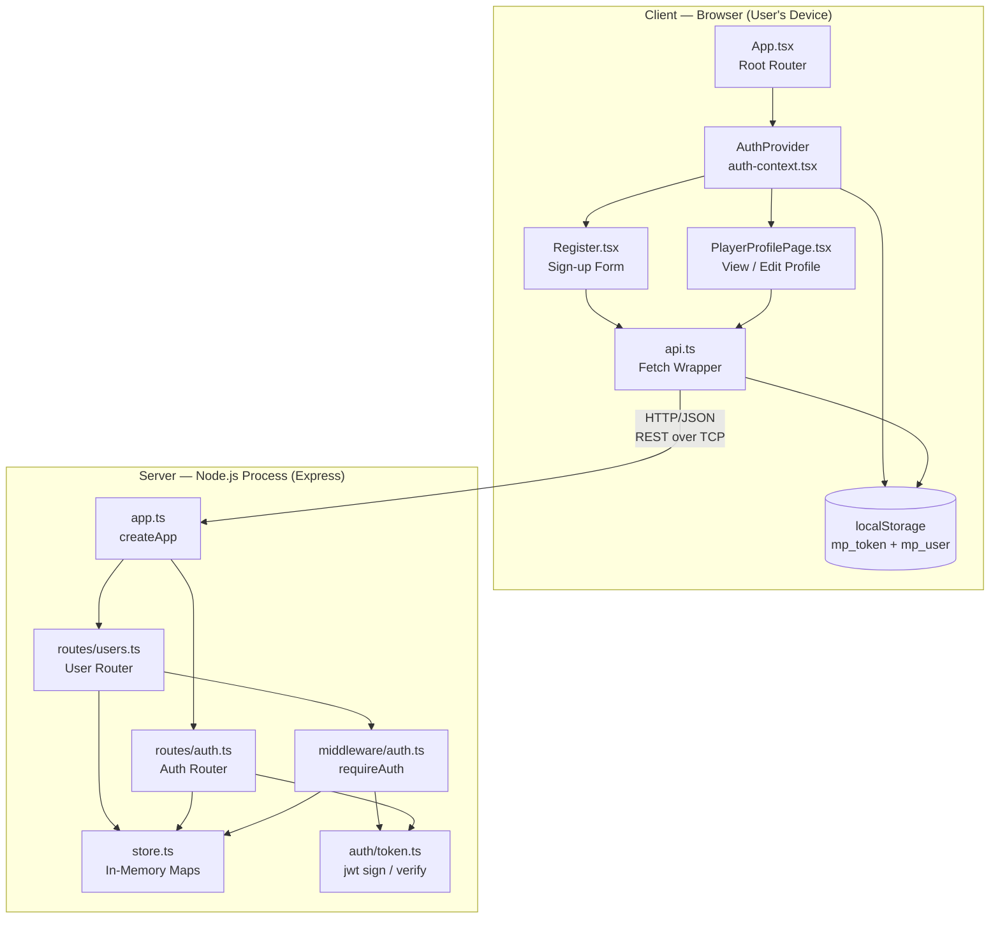
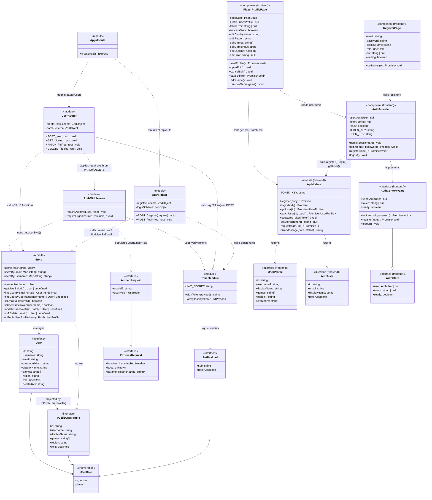

# Dev Spec — US6: Player Profile Creation

---

## Ownership

| Role | Name |
|---|---|
| Primary Owner | André Miller |
| Secondary Owner | Eshar Hans |

**Merge date:** March 26, 2026 (merged into `main`)

---

## User Story

> As a player, I want to create a profile listing my display name, games I play, and general location so that organizers and other community members can recognize and find me across events.

---

## Architecture Diagram

The diagram below shows every named component and the execution environment (client browser, Node.js server process) in which it runs.

---

## Information Flow Diagram

This diagram shows which user information and application data flows between components and in which direction.

```mermaid
sequenceDiagram
    actor User
    participant Browser as Browser (Client)
    participant LS as localStorage
    participant API as api.ts (fetch wrapper)
    participant Server as Express Server
    participant Store as store.ts (In-Memory)
    participant JWT as auth/token.ts

    %% Registration flow
    User->>Browser: Fills Register form\n(email, password, displayName, role)
    Browser->>API: register({email, password, displayName, role})
    API->>Server: POST /api/auth/register\n{email, password, displayName, role}
    Server->>Store: createUser(email, passwordHash, displayName, role)
    Store-->>Server: User record (id, username, email, …)
    Server->>JWT: signToken({sub: id, role})
    JWT-->>Server: JWT string (7-day expiry)
    Server-->>API: 201 {token, user: {id, email, displayName, role}}
    API-->>Browser: {token, user}
    Browser->>LS: localStorage.setItem(mp_token, mp_user)

    %% Profile creation (POST /api/users)
    User->>Browser: Submits profile form\n(username, email, password,\ndisplayName, games[], region)
    Browser->>API: POST /api/users body
    API->>Server: POST /api/users\n{username, email, password,\ndisplayName, games, region}
    Server->>Store: isEmailTaken / isUsernameTaken checks
    Store-->>Server: boolean
    Server->>Store: createUser(...)
    Store-->>Server: User record
    Server->>JWT: signToken({sub: id, role})
    JWT-->>Server: JWT string
    Server-->>API: 201 {token, user}
    API-->>Browser: profile data + token
    Browser->>LS: persist token + user

    %% Public profile view (GET /api/users/:id)
    User->>Browser: Navigates to /players/:id
    Browser->>API: getUser(id) — no auth token sent
    API->>Server: GET /api/users/:id
    Server->>Store: getUserById(id)
    Store-->>Server: User record
    Server-->>API: 200 PublicUserProfile\n{id, username, displayName,\ngames, region, role}
    API-->>Browser: UserProfile object
    Browser-->>User: Renders profile page

    %% Authenticated profile edit (PATCH /api/users/:id)
    User->>Browser: Edits profile, clicks Save
    Browser->>LS: reads mp_token
    LS-->>Browser: JWT
    Browser->>API: patchUser(id, {displayName, games, region})
    API->>Server: PATCH /api/users/:id\nAuthorization: Bearer <JWT>
    Server->>JWT: verifyToken(token)
    JWT-->>Server: {sub, role}
    Server->>Store: getUserById(sub) — identity check
    Store-->>Server: User
    Server->>Store: updateUserProfile(id, patch)
    Store-->>Server: Updated User
    Server-->>API: 200 PublicUserProfile
    API-->>Browser: Updated profile
    Browser-->>User: Success toast shown
```

---

## Class Diagram

> **Note:** The project is written in TypeScript. All persistent data-shaping types are `interface` declarations; runtime behavior lives in module-level functions. The diagram maps these to a class model, with modules shown as classes holding their exported functions as methods. All interfaces are shown as classes with `<<interface>>` stereotypes; the `AuthedRequest` interface extends (inherits from) `express.Request`.

---

## Class Reference

Each module or interface that is relevant to US6 is listed below. Public members are listed first, grouped by concept. Private members follow.

---

### `User` — `src/types.ts`

Represents a full stored user record. Never sent to the client as-is; `toPublicUserProfile` is used to strip sensitive fields.

**Public fields — identity**
| Field | Type | Purpose |
|---|---|---|
| `id` | `string` | UUID generated at creation; primary key for all lookups |
| `username` | `string` | Unique handle (1–40 chars, case-insensitive for uniqueness checks) |
| `displayName` | `string` | Human-readable name shown in bracket views and profile pages |
| `role` | `UserRole` | `"player"` or `"organizer"` — controls route authorization |

**Public fields — contact & content**
| Field | Type | Purpose |
|---|---|---|
| `email` | `string` | Unique login identifier; stored lowercase; never returned by public API |
| `games` | `string[]` | List of games the player competes in |
| `region` | `string` | General location string (e.g., "Pittsburgh") |

**Public fields — lifecycle**
| Field | Type | Purpose |
|---|---|---|
| `passwordHash` | `string` | bcrypt hash of the user's password; never sent over the wire |
| `deletedAt?` | `string` | ISO-8601 timestamp set on soft-delete; absent for active users |

---

### `PublicUserProfile` — `src/types.ts`

The safe outbound projection of a `User`. Contains no credentials or contact information.

**Public fields**
| Field | Type | Purpose |
|---|---|---|
| `id` | `string` | Stable user reference for URLs (`/players/:id`) |
| `username` | `string` | Display handle |
| `displayName` | `string` | Full display name |
| `games` | `string[]` | Game tags shown on profile page |
| `region` | `string` | General location |
| `role` | `UserRole` | Displayed so viewers know if the account is an organizer |

---

### `UserRole` — `src/types.ts`

A string union type constraining roles to known values.

**Public members**
| Value | Purpose |
|---|---|
| `"player"` | Default role; can register for events, create a profile |
| `"organizer"` | Can create tournaments and generate brackets |

---

### `JwtPayload` — `src/auth/token.ts`

The shape of the data encoded in every JWT issued by the system.

**Public fields**
| Field | Type | Purpose |
|---|---|---|
| `sub` | `string` | User UUID — used by `requireAuth` to look up the actor |
| `role` | `UserRole` | Cached role — avoids a DB lookup inside `requireOrganizer` |

---

### `AuthedRequest` — `src/middleware/auth.ts`

Extends Express's `Request` with fields injected by `requireAuth`. Route handlers cast `req` to this type after the middleware runs.

**Public fields (added by middleware)**
| Field | Type | Purpose |
|---|---|---|
| `userId?` | `string` | UUID of the authenticated user; `undefined` before middleware runs |
| `userRole?` | `UserRole` | Role of the authenticated user |

---

### `Store` — `src/store.ts`

Singleton in-memory data store. All data lives in module-level `Map`s; each exported function is stateless except for its effect on those maps.

**Public functions — user CRUD**
| Function | Purpose |
|---|---|
| `createUser(input)` | Creates a new `User`, assigns a UUID, normalizes email/username to lowercase, and registers them in all three index maps |
| `getUserById(id)` | Returns a `User` (including soft-deleted ones) or `undefined`; callers check `deletedAt` |
| `findUserByEmail(email)` | Looks up a non-deleted user by email; used by login and duplicate-check logic |
| `findUserByUsername(username)` | Looks up a user by lowercase username |
| `isEmailTaken(email)` | Quick uniqueness check; returns `true` if the email is in the index map |
| `isUsernameTaken(username)` | Quick uniqueness check; returns `true` if the username is in the index map |
| `updateUserProfile(id, patch)` | Applies a partial update to display name, games, region, or username; maintains username index consistency |
| `softDeleteUser(id)` | Stamps `deletedAt`, removes entries from email/username indexes |
| `toPublicUserProfile(user)` | Projects a `User` to a `PublicUserProfile`, copying `games` array to avoid mutation |

**Public functions — test support**
| Function | Purpose |
|---|---|
| `__resetStoreForTests()` | Clears all maps; called in `afterEach` in `api.test.ts` |

**Private fields (module-level)**
| Field | Type | Purpose |
|---|---|---|
| `users` | `Map<string, User>` | Primary user store, keyed by UUID |
| `usersByEmail` | `Map<string, string>` | Secondary index mapping lowercase email → UUID |
| `usersByUsername` | `Map<string, string>` | Secondary index mapping lowercase username → UUID |

---

### `TokenModule` — `src/auth/token.ts`

Manages JWT signing and verification using the `jsonwebtoken` library.

**Public functions**
| Function | Purpose |
|---|---|
| `signToken(payload)` | Signs a `JwtPayload` with a 7-day expiry; returns the JWT string |
| `verifyToken(token)` | Verifies the signature and expiry; throws on failure; returns the parsed `JwtPayload` |

**Private fields**
| Field | Purpose |
|---|---|
| `JWT_SECRET` | Loaded from `process.env.JWT_SECRET`; falls back to a development-only constant. Must be overridden in production. |

---

### `AuthMiddleware` — `src/middleware/auth.ts`

Express middleware functions that guard routes requiring authentication or a specific role.

**Public functions**
| Function | Purpose |
|---|---|
| `requireAuth(req, res, next)` | Reads the `Authorization: Bearer <token>` header, verifies the JWT via `verifyToken`, confirms the user exists and is not deleted in the store, and populates `req.userId` / `req.userRole` before calling `next()` |
| `requireOrganizer(req, res, next)` | Must be chained after `requireAuth`; returns 403 if `req.userRole !== "organizer"` |

---

### `UserRouter` — `src/routes/users.ts`

Express `Router` mounted at `/api/users`. Implements all four US6 endpoints.

**Public route handlers**
| Handler | Method + Path | Purpose |
|---|---|---|
| `POST /` | `POST /api/users` | Validates body with `createUserSchema`, checks for duplicate email/username, calls `createUser`, and returns 201 with a JWT and public profile |
| `GET /:id` | `GET /api/users/:id` | Public; returns `PublicUserProfile` or 404 |
| `PATCH /:id` | `PATCH /api/users/:id` (auth required) | Validates with `patchSchema`, enforces owner-only access, checks username uniqueness if changed, calls `updateUserProfile`, returns updated profile |
| `DELETE /:id` | `DELETE /api/users/:id` (auth required) | Enforces owner access, calls `softDeleteUser`, returns 204 |

**Private fields (module-level)**
| Field | Purpose |
|---|---|
| `createUserSchema` | Zod schema validating `username`, `email`, `password`, `displayName`, `games`, `region`, `role` on profile creation |
| `patchSchema` | Zod schema for partial updates; requires at least one field; rejects `email` patching |

---

### `AuthRouter` — `src/routes/auth.ts`

Express `Router` mounted at `/api/auth`. Handles registration and login; both paths also create or verify user records.

**Public route handlers**
| Handler | Method + Path | Purpose |
|---|---|---|
| `POST /register` | Creates a user with minimal fields (email, password, displayName, role) and returns a JWT |
| `POST /login` | Verifies email + bcrypt password; returns a JWT on success |

**Private fields**
| Field | Purpose |
|---|---|
| `registerSchema` | Zod schema for the auth-register payload |
| `loginSchema` | Zod schema for the login payload |

---

### `AppModule` — `src/app.ts`

Factory function that creates and configures the Express application.

**Public functions**
| Function | Purpose |
|---|---|
| `createApp()` | Attaches CORS, JSON body parser, health endpoint, and all route modules; in production mode also serves the Vite build's `dist/` as static files |

---

### `ApiModule` — `frontend/src/api.ts`

Client-side fetch wrapper that handles token injection, JSON serialization, and error extraction.

**Public functions — auth**
| Function | Purpose |
|---|---|
| `register(body)` | Posts to `/api/auth/register`; returns `{token, user: AuthUser}` |
| `login(body)` | Posts to `/api/auth/login`; returns `{token, user: AuthUser}` |
| `setStoredToken(token)` | Writes or removes the JWT from `localStorage` |

**Public functions — profile**
| Function | Purpose |
|---|---|
| `getUser(id)` | `GET /api/users/:id` without auth; returns `UserProfile` |
| `patchUser(id, patch)` | `PATCH /api/users/:id` with auth; returns updated `UserProfile` |

**Private functions**
| Function | Purpose |
|---|---|
| `getStoredToken()` | Reads `mp_token` from `localStorage` |
| `request(path, init)` | Core fetch wrapper; injects `Authorization` header when `auth !== false`; parses JSON; throws descriptive errors on non-2xx |
| `errorMessage(data, status)` | Extracts a human-readable message from an API error response object |

---

### `UserProfile` — `frontend/src/api.ts`

Frontend interface mirroring `PublicUserProfile`, extended with an optional `createdAt` timestamp from the API.

**Public fields**
| Field | Purpose |
|---|---|
| `id` | User UUID (mirrors server) |
| `username?` | Optional handle |
| `displayName` | Rendered on the profile page header |
| `games` | Rendered as game tag chips |
| `region?` | Rendered below the display name |
| `createdAt` | ISO-8601 timestamp; reserved for future "member since" display |

---

### `AuthUser` — `frontend/src/api.ts`

Credentials-lite representation of the logged-in user, persisted in `localStorage` under `mp_user`.

**Public fields**
| Field | Purpose |
|---|---|
| `id` | Used to identify the "own profile" for edit access |
| `email` | Displayed in account settings |
| `displayName` | Shown in the nav bar |
| `role` | Gates organizer-only UI |

---

### `AuthState` / `AuthContextValue` — `frontend/src/auth-context.tsx`

Interfaces that define the shape of React context provided by `AuthProvider`.

**Public fields — state**
| Field | Purpose |
|---|---|
| `user` | Currently logged-in `AuthUser` or `null` |
| `token` | Raw JWT string or `null` |
| `ready` | `false` until hydration from `localStorage` completes; prevents flash-of-wrong-state |

**Public functions — actions**
| Function | Purpose |
|---|---|
| `login(email, password)` | Calls `api.login`, then `persistSession` |
| `register(input)` | Calls `api.register`, then `persistSession` |
| `logout()` | Clears state and `localStorage` entries |

---

### `AuthProvider` — `frontend/src/auth-context.tsx`

React context provider. Wraps the entire app and exposes auth state to any component via `useAuth()`.

**Public functions**
| Function | Purpose |
|---|---|
| (via context) `login`, `register`, `logout` | See `AuthContextValue` above |

**Private fields / functions**
| Field/Function | Purpose |
|---|---|
| `user` state | `useState<AuthUser \| null>` |
| `token` state | `useState<string \| null>` |
| `ready` state | `useState<boolean>` — starts `false` |
| `TOKEN_KEY` | Constant `"mp_token"` used for `localStorage` key |
| `USER_KEY` | Constant `"mp_user"` used for `localStorage` key |
| `persistSession(t, u)` | Writes token + user to state and `localStorage` atomically |
| hydration `useEffect` | On mount, reads `localStorage`, validates the cached user still exists in the backend, clears stale sessions if the server has been restarted |

---

### `PlayerProfilePage` — `frontend/src/pages/PlayerProfilePage.tsx`

Page component rendered at `/players/:id`. Supports five discrete UI states: `loading`, `error`, `empty`, `view`, and `edit`.

**Public functions (component lifecycle)**
| Function | Purpose |
|---|---|
| `loadProfile()` | Async; calls `api.getUser(profileId)`, transitions page state to `view`, `empty`, or `error` |
| `openEdit()` | Seeds edit-form state from the current profile and transitions to `"edit"` |
| `cancelEdit()` | Resets to `"view"` or `"empty"` without saving |
| `saveEdit(e)` | Submits `api.patchUser`, updates profile state, shows success toast |
| `addGame()` | Appends a trimmed game string to `editGames` if not already present |
| `removeGame(game)` | Filters `game` out of `editGames` |

**Private state fields**
| Field | Purpose |
|---|---|
| `pageState` | Drives which UI block is rendered |
| `profile` | Loaded `UserProfile` object |
| `fetchError` | Error string shown in the error banner |
| `successToast` | Boolean driving the success toast |
| `editDisplayName` | Controlled input for display name in edit mode |
| `editRegion` | Controlled input for region |
| `editGames` | Controlled array of game tags |
| `editGameInput` | Controlled input for adding a new game tag |
| `editLoading` | Disables Save button during API call |
| `editError` | Inline error shown inside the edit form |

---

### `RegisterPage` — `frontend/src/pages/Register.tsx`

Form page at `/register` for creating a new account. After success, redirects to the `?next=` parameter destination.

**Private state fields**
| Field | Purpose |
|---|---|
| `email` | Controlled input |
| `password` | Controlled input |
| `displayName` | Controlled input |
| `role` | `"player"` or `"organizer"` — select input |
| `err` | Error string shown in the error banner |
| `loading` | Disables submit button during API call |

**Private function**
| Function | Purpose |
|---|---|
| `onSubmit(e)` | Prevents default, calls `auth.register(...)`, navigates on success, catches and displays errors |
| `safeNext(raw)` | Validates the `?next=` param — rejects absolute URLs and `//`-prefixed values to prevent open redirect |

---

## Technologies

### Runtime & Language

| Technology | Version | Used For | Why Chosen | Source / Docs |
|---|---|---|---|---|
| **Node.js** | ≥ 20.x | Server runtime environment | LTS; required by the `--watch` flag and modern ESM support | https://nodejs.org — Ryan Dahl / Node.js Foundation |
| **TypeScript** (backend) | ~5.8.2 | Static typing for all server code, routes, store, and types | Catches contract mismatches between route handlers and store at compile time; strict mode enforced | https://www.typescriptlang.org — Microsoft |
| **TypeScript** (frontend) | ~5.8.2 | Static typing for React components, API types, and context | Shared type discipline with the backend; generates zero runtime code | https://www.typescriptlang.org — Microsoft |

### Server Framework & Middleware

| Technology | Version | Used For | Why Chosen | Source / Docs |
|---|---|---|---|---|
| **Express** | ^4.21.2 | HTTP server, routing (`/api/users`, `/api/auth`), middleware pipeline | Minimal, widely documented, compatible with the team's prior experience | https://expressjs.com — StrongLoop / OpenJS Foundation |
| **cors** | ^2.8.5 | `Access-Control-Allow-Origin` header in development (Vite dev server on port 5173 → API on port 3000) | Drop-in Express middleware; zero configuration needed for the dev proxy pattern | https://github.com/expressjs/cors |

### Authentication & Security

| Technology | Version | Used For | Why Chosen | Source / Docs |
|---|---|---|---|---|
| **bcryptjs** | ^3.0.2 | Password hashing and comparison on registration and login | Pure-JS bcrypt; no native bindings required; bcrypt's cost factor slows brute-force attacks | https://github.com/dcodeIO/bcrypt.js |
| **jsonwebtoken** | ^9.0.2 | Signing and verifying JWTs that carry `{sub, role}` claims | Mature, well-audited library; HS256 default is sufficient for a shared-secret system | https://github.com/auth0/node-jsonwebtoken |

### Input Validation

| Technology | Version | Used For | Why Chosen | Source / Docs |
|---|---|---|---|---|
| **zod** | ^3.24.2 | Schema validation on all inbound request bodies (`createUserSchema`, `patchSchema`) | TypeScript-first; `safeParse` returns typed data eliminating manual `as` casts; `flatten()` produces structured error messages | https://zod.dev — Colin McDonnell |

### Frontend Framework & Build

| Technology | Version | Used For | Why Chosen | Source / Docs |
|---|---|---|---|---|
| **React** | ^18.3.1 | Component model, state management (`useState`, `useEffect`, `useCallback`, `useMemo`), Context API | Industry standard; team familiarity; Concurrent Mode features available for future use | https://react.dev — Meta |
| **react-dom** | ^18.3.1 | DOM renderer for React; required alongside React | Paired package; no alternative for web DOM rendering in React 18 | https://react.dev |
| **react-router-dom** | ^6.30.0 | Client-side routing (`BrowserRouter`, `Routes`, `Route`, `useParams`, `useNavigate`, `useSearchParams`, `Link`) | v6 data API and nested layouts match the dashboard shell pattern; widely adopted | https://reactrouter.com — Remix Software |
| **lucide-react** | ^0.483.0 | SVG icon components used throughout `PlayerProfilePage` (`Edit2`, `Gamepad2`, `Globe`, `CheckCircle`, `AlertCircle`, `X`, `RefreshCw`, `Calendar`, `Plus`) | Tree-shakeable; consistent icon style; React-native props (size, strokeWidth) | https://lucide.dev |
| **Vite** | ^6.2.1 | Frontend dev server (HMR), production bundler, API proxy (`/api` → `localhost:3000`) | Sub-second HMR; native ESM; the proxy eliminates CORS handling during development | https://vitejs.dev — Evan You / VoidZero |
| **@vitejs/plugin-react** | ^4.3.4 | Babel-based JSX transform and React Fast Refresh in the Vite pipeline | Official Vite plugin for React; required for HMR in `.tsx` files | https://github.com/vitejs/vite-plugin-react |

### Testing

| Technology | Version | Used For | Why Chosen | Source / Docs |
|---|---|---|---|---|
| **vitest** | ^3.0.9 | Test runner for all `*.test.ts` files; `describe`, `it`, `expect`, `afterEach` | Vite-native; shares the same config and TypeScript setup; no separate `ts-node` or `babel-jest` needed | https://vitest.dev — Anthony Fu / VoidZero |
| **supertest** | ^7.0.0 | HTTP assertion layer for integration tests — fires real HTTP requests against a bound Express app in-process | Avoids network I/O in tests; idiomatic with Express; used in every `describe` block for US6 routes | https://github.com/ladjs/supertest |

### Developer Experience

| Technology | Version | Used For | Why Chosen | Source / Docs |
|---|---|---|---|---|
| **tsx** | ^4.19.3 | Runs TypeScript source with `node --watch` without a compile step during development | Zero-config TypeScript execution in Node.js; faster than `ts-node` for watch mode | https://github.com/privatenumber/tsx |
| **concurrently** | ^9.1.2 | Runs `dev:api` and `dev:web` in parallel from a single `npm run dev` command | Colored, labeled output; cross-platform; avoids two terminal windows | https://github.com/open-cli-tools/concurrently |

---

## Data Storage

> **Important:** In the current MVP implementation, all data is stored in **module-level in-memory `Map`s** inside `src/store.ts`. There is **no persistent database** (no SQL, no MongoDB, no Redis). Data is lost when the Node.js process exits or restarts.

The design is intentionally scoped to the user story's requirement — the following describes what *is* stored in long-term memory (for this sprint: the in-process `Map`) and the byte cost per record.

### Stored Type: `User`

One record is created per registered user.

| Field | DB Column | Type | Nullable | Purpose | Bytes (worst case) |
|---|---|---|---|---|---|
| `id` | `id` | UUID string (36 chars) | No | Primary key; used in all URLs and foreign references | 36 B |
| `username` | `username` | string, max 40 chars | No | Unique login handle; lowercase index as well | 40 B (data) + 40 B (index key) |
| `email` | `email` | string, RFC 5321 max 254 chars | No | Unique login identifier; lowercase index | 254 B (data) + 254 B (index key) |
| `passwordHash` | `password_hash` | bcrypt string, always 60 chars | No | Verifies the user's password without storing the plaintext | 60 B |
| `displayName` | `display_name` | string, max 120 chars | No | Human-readable name displayed in UI | 120 B |
| `games` | `games` | JSON array of strings | No | Tags used for profile display and tournament context; each string max 120 chars, up to ~20 games typical | ~2,400 B |
| `region` | `region` | string, max 120 chars | No | General geographic label | 120 B |
| `role` | `role` | enum: "player" \| "organizer" | No | Authorization gate for organizer routes | 10 B |
| `deletedAt` | `deleted_at` | ISO-8601 string (24 chars) | Yes | Soft-delete tombstone; absent until the user deletes their account | 24 B |

**Estimated bytes per user record:** ≈ 3,358 B worst case (~3.3 KB), dominated by the games array.

**Secondary indexes (in-memory only):**
- `usersByEmail`: maps lowercase email (254 B) → UUID (36 B). ~290 B per user.
- `usersByUsername`: maps lowercase username (40 B) → UUID (36 B). ~76 B per user.

**Total estimated storage per user:** ~3.7 KB

---

## Failure Mode Analysis

### Frontend Application Failures

| Failure | User-Visible Effect | Internally-Visible Effect |
|---|---|---|
| **Process crashes** | Browser tab goes blank or shows a crash page; the user loses any unsaved edit-form input; the route they were on is gone | No server-side impact; on reload the React app bootstraps fresh; `localStorage` session (`mp_token`, `mp_user`) is preserved across the crash |
| **All runtime state lost** (e.g., hot-reload wipes state, `useState` reset) | Profile edit form inputs are cleared; the page state reverts to `"loading"` and re-fetches from the server; no data loss because the source of truth is the server | `useEffect` dependency on `ready`/`profileId` triggers a fresh `api.getUser()` call automatically |
| **All stored data erased** (`localStorage` cleared) | User is silently logged out on the next page load; `AuthProvider` hydration reads nothing and sets `user: null`; the user is redirected to `/login?next=…` | `mp_token` and `mp_user` are gone; no server data affected; the user can log back in |
| **Database data appears corrupt** (server returns malformed JSON) | `api.ts` `request()` catches the JSON parse error and throws; `PlayerProfilePage` catches it in `loadProfile()` and sets `pageState = "error"` with the error message | The error banner component is rendered; the user sees a retry button |
| **Remote procedure call fails** (fetch throws, 5xx, network timeout) | Same as corrupt data path — error banner is shown on the profile or edit page; in-flight edit changes are preserved in component state; the user can retry | The `api.ts` `request()` function throws a descriptive error; component-level `catch` blocks handle it |
| **Client overloaded** (main thread blocked, janky UI) | Animations and interactions stutter; form inputs lag; the app remains functional once the thread frees | No server-side impact; React renders are synchronous on the main thread |
| **Client out of RAM** | Browser may kill the tab (OOM); same effect as a process crash | No server-side impact |
| **Database out of space** (in-memory `Map` fills heap) | `createUser` call throws an OOM error inside Express; the route handler does not catch it; Node.js default exception handler writes to stderr; the API returns a 500 to the client; the Register page's error banner shows "Registration failed" | The server process may become unstable; all in-memory user data is at risk if Node crashes |
| **Lost network connectivity** | All `fetch` calls in `api.ts` throw `TypeError: Failed to fetch`; error banners appear on profile and register pages; the app shows cached state from `localStorage` but cannot validate or update it | No server-side impact |
| **Lost access to database** | Not applicable — the database *is* the server process memory; if the server is down, the frontend receives connection errors on all API calls | All API calls return network errors or never connect |
| **Bot signs up and spams users** | A bot can call `POST /api/users` or `POST /api/auth/register` in a loop; each call succeeds if the email and username are unique; registration creates a valid JWT immediately | The in-memory `users` map grows unboundedly; no rate-limiting or CAPTCHA is currently implemented; the server heap may exhaust if the attack is sustained |

---

## Personally Identifying Information (PII)

### PII Inventory

| Data Item | Why Stored | How Stored | How It Entered the System | Path In | Path Out |
|---|---|---|---|---|---|
| **Email address** | Required to uniquely identify a user account across sessions and to log in; the only user-recoverable credential | Stored as a UTF-8 string in the `User` record inside the in-memory `users` Map; also stored as a `localStorage` key (`mp_user`) in the user's browser | Entered by the user in the `Register` or `POST /api/users` form | `Register.tsx` → `AuthProvider.register()` → `api.register()` → `POST /api/auth/register` → `AuthRouter` → `createUser()` → `users` Map | `GET /api/users/:id` does **not** return email; email is only returned in the registration response and the login response. It flows out: `users` Map → `POST /api/auth/register` response → `AuthRouter` → `api.register()` → `AuthProvider.persistSession()` → `localStorage(mp_user)` |
| **Display name** | Shown publicly on the profile page, bracket views, and entrant lists | Stored in the `User` record in the `users` Map; also in `localStorage(mp_user)` | User types it into the display name field on `/register` or the `POST /api/users` form | `Register.tsx` / `PlayerProfilePage.tsx` → `api.register()` or `api.patchUser()` → route handler → `createUser()` / `updateUserProfile()` → `users` Map | Returned by `toPublicUserProfile()` in `GET /api/users/:id` and `PATCH /api/users/:id`; also cached in `localStorage(mp_user)` |
| **Username** (handle) | Uniquely identifies a user in URLs and community spaces; public facing | Stored in `User.username` and indexed in `usersByUsername` | Entered in the username field of the `POST /api/users` form (not in the auth-register flow) | `PlayerProfilePage.tsx` (create via `POST /api/users`) or `PATCH /api/users/:id` → `UserRouter` → `createUser()` / `updateUserProfile()` | Returned in `PublicUserProfile` on `GET /api/users/:id` |
| **Region** (general location) | Displayed on the profile page so organizers and players can find local opponents | Stored as a free-form string in `User.region` | Entered in the region field of the `POST /api/users` or edit-profile form | `PlayerProfilePage.tsx` → `api.patchUser()` → `UserRouter` → `updateUserProfile()` → `users` Map | Returned in `PublicUserProfile` on `GET /api/users/:id` |
| **Password** (raw, transient) | Must cross the wire to be authenticated; not stored | **Not stored.** The raw password exists only in browser form state and in the JSON body of the HTTP request. It is hashed with bcrypt (cost factor 10) immediately on the server inside the route handler; only the hash is stored. | Entered in the password field of `/register` or `POST /api/users` | `Register.tsx` → `api.register()` → `POST /api/auth/register` → `bcrypt.hashSync(password, 10)` → `createUser({passwordHash})` → `users` Map (hash only) | Never leaves storage; only `bcrypt.compareSync(plain, hash)` is used during login |
| **Password hash** | Required to verify login without storing the plaintext | Stored as a 60-character bcrypt string in `User.passwordHash`; never included in any API response | Produced by `bcrypt.hashSync(password, 10)` inside `AuthRouter` or `UserRouter` | `AuthRouter.POST /register` / `UserRouter.POST /` → `bcrypt.hashSync()` → `createUser({passwordHash})` → `users` Map | Never flows out to the client; `toPublicUserProfile()` deliberately omits it |

### Storage Security Responsibilities

| Unit of Storage | Responsible People |
|---|---|
| In-memory `users` Map (server heap) | André Miller, Eshar Hans |
| `localStorage` (`mp_token`, `mp_user`) in the browser | André Miller, Eshar Hans |

### Auditing Procedures

**Routine access:** All reads and writes to user records pass through the eight exported functions in `src/store.ts`. Any audit log layer can be inserted at these function boundaries. Currently, no audit logging is implemented beyond Node.js process stdout.

**Non-routine access:** Any direct inspection of the in-memory `Map` during a live server session requires access to the Node.js process (e.g., a REPL attached to the process, or a debugger). Access to the host machine is therefore the audit boundary for non-routine access.

**Recommended future controls (not yet implemented):** structured access logging middleware on `GET /api/users/:id`; rate-limiting on `POST /api/users` and `POST /api/auth/register`; express-audit-log or similar for PII-touching routes.

### Minors' PII

**Does the system solicit or store PII of minors under 18?**
The registration form does **not** include a date-of-birth field or any age verification mechanism. There is no age gate, no COPPA-compliant consent flow, and no technical control preventing a minor from registering. **A minor could register and their PII (email, display name, region) would be stored under the same conditions as an adult.**

**Why:** The MVP scope does not include age verification. The product is aimed at local fighting-game community events, which typically include players of all ages.

**Guardian permission:** The system does **not** currently solicit a guardian's permission before collecting a minor's PII. This is a known compliance gap for COPPA (Children's Online Privacy Protection Act, U.S.) and similar regulations.

**Policy on minors' PII and access by convicted/suspected child abusers:** The MatchPoint team has no implemented policy or technical control for this. The application collects display names and general regions that are publicly visible without login — no controls exist to restrict this information from any particular class of person. This is an open risk that must be addressed before the platform scales beyond a closed-beta environment.
